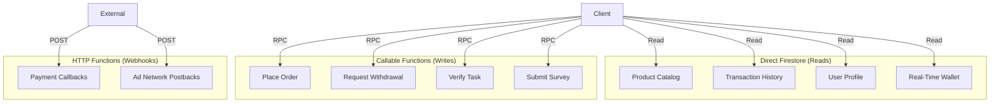
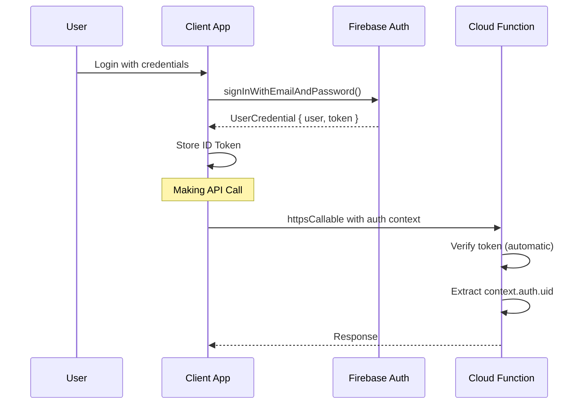
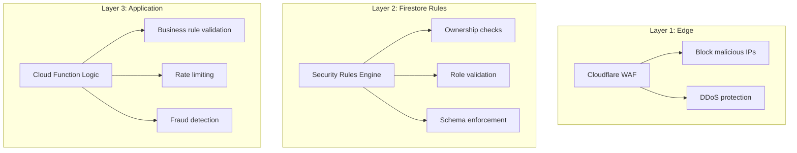
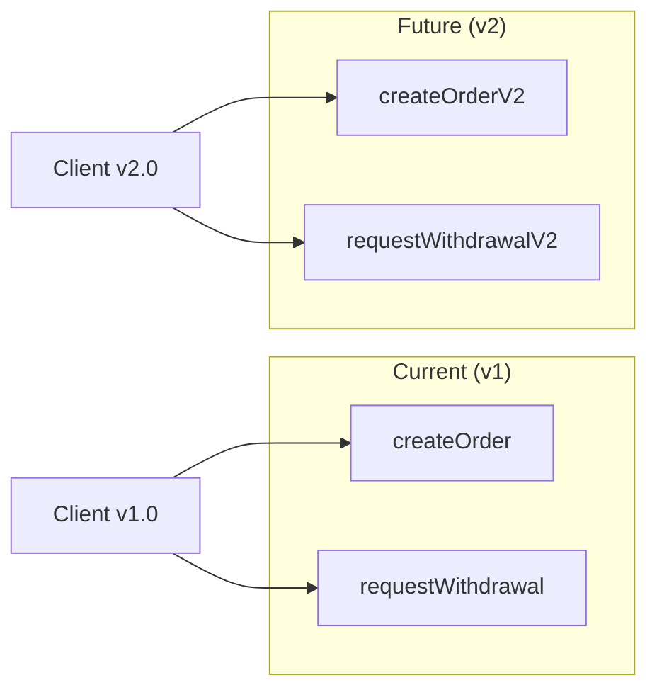

# API Specification

> **Document Version**: 2.0  
> **Last Updated**: January 2026  
> **Audience**: Frontend Engineers, Integration Partners, API Consumers

---

## Table of Contents
1. [API Philosophy](#api-philosophy)
2. [Authentication Model](#authentication-model)
3. [Authorization Layers](#authorization-layers)
4. [Core Endpoints](#core-endpoints)
5. [Error Model](#error-model)
6. [Rate Limiting](#rate-limiting)
7. [Versioning Strategy](#versioning-strategy)
8. [Webhook Contracts](#webhook-contracts)

---

## API Philosophy

### Hybrid Architecture



### Design Principles

| Principle | Implementation |
|:----------|:---------------|
| **Reads are Real-Time** | Client subscribes to Firestore; no polling |
| **Writes are Transactional** | Cloud Functions handle atomic operations |
| **Idempotency by Default** | All mutations require `idempotencyKey` |
| **Fail Fast** | Validate inputs before processing |
| **Rich Errors** | Structured error codes with actionable messages |

---

## Authentication Model

### Token Flow



### Token Specifications

| Property | Value |
|:---------|:------|
| **Token Type** | Firebase ID Token (JWT) |
| **Algorithm** | RS256 |
| **Lifetime** | 1 hour |
| **Refresh** | Automatic via Refresh Token (26 weeks) |
| **Transport** | Bearer token in Authorization header (HTTP) / Automatic (Callable) |

### Token Payload

```json
{
  "iss": "https://securetoken.google.com/thinkmart-prod",
  "aud": "thinkmart-prod",
  "auth_time": 1706000000,
  "user_id": "abc123xyz",
  "sub": "abc123xyz",
  "iat": 1706000000,
  "exp": 1706003600,
  "email": "user@example.com",
  "email_verified": true,
  "firebase": {
    "identities": {
      "email": ["user@example.com"]
    },
    "sign_in_provider": "password"
  },
  "admin": false
}
```

---

## Authorization Layers

### Multi-Layer Security



### Permission Matrix

| Resource | Anonymous | User | Admin |
|:---------|:----------|:-----|:------|
| `products/*` | Read | Read | Read/Write |
| `users/{uid}` | - | Own only | All |
| `wallets/{uid}` | - | Own only | Read only |
| `transactions/*` | - | Own only | All |
| `orders/*` | - | Own only | All |
| `withdrawals/*` | - | Own only | All |
| `tasks/*` | - | Read | Read/Write |

---

## Core Endpoints

### Callable Functions (Firebase Callable)

---

#### `createOrder`

Creates a new order, debits wallet, and reserves inventory.

**Request**:
```typescript
interface CreateOrderRequest {
  items: Array<{
    productId: string;
    quantity: number;
  }>;
  shippingAddressId: string;
  paymentMethod: 'WALLET_CASH' | 'WALLET_COIN';
  idempotencyKey: string;  // Required. UUID v4.
}
```

**Response**:
```typescript
interface CreateOrderResponse {
  success: boolean;
  orderId: string;
  total: number;
  newBalance: number;
  estimatedDelivery: string;  // ISO date
}
```

**Error Codes**:
| Code | Meaning | User Action |
|:-----|:--------|:------------|
| `insufficient-funds` | Wallet balance too low | Add funds or reduce cart |
| `out-of-stock` | Product unavailable | Remove item from cart |
| `invalid-address` | Address validation failed | Update address |
| `already-processed` | Duplicate idempotency key | Show cached result |

**Idempotency**: Required. Same key returns cached result.

**Rate Limit**: 10 orders per user per hour.

---

#### `requestWithdrawal`

Initiates a payout request.

**Request**:
```typescript
interface RequestWithdrawalRequest {
  amount: number;           // In cents (min $10, max $500)
  method: 'BANK_TRANSFER' | 'PAYPAL' | 'USDT_TRC20';
  paymentDetails: {
    // Bank Transfer
    bankName?: string;
    accountNumber?: string;
    routingNumber?: string;
    accountHolderName?: string;
    
    // PayPal
    paypalEmail?: string;
    
    // Crypto
    walletAddress?: string;
  };
  idempotencyKey: string;
}
```

**Response**:
```typescript
interface RequestWithdrawalResponse {
  success: boolean;
  withdrawalId: string;
  status: 'PENDING';
  estimatedProcessingTime: string;  // "24-48 hours"
  fee: number;
  netAmount: number;
}
```

**Error Codes**:
| Code | Meaning |
|:-----|:--------|
| `insufficient-funds` | Balance below requested amount |
| `below-minimum` | Amount less than $10 |
| `exceeds-daily-limit` | Over $500/day limit |
| `cooldown-active` | Recent password change; 24h hold |
| `account-suspended` | User under review |

**Rate Limit**: 1 withdrawal per user per 24 hours.

---

#### `verifyTask`

Validates task completion and credits reward.

**Request**:
```typescript
interface VerifyTaskRequest {
  taskId: string;
  sessionId: string;       // From task_sessions
  proofToken?: string;     // For external verification
  proofImageUrl?: string;  // For screenshot proof
}
```

**Response**:
```typescript
interface VerifyTaskResponse {
  success: boolean;
  reward: number;
  newBalance: number;
  dailyTasksRemaining: number;
}
```

**Error Codes**:
| Code | Meaning |
|:-----|:--------|
| `task-not-found` | Invalid taskId |
| `session-expired` | Session older than 24 hours |
| `duration-too-short` | Time spent below minimum |
| `already-completed` | Task done today |
| `daily-limit-reached` | Max tasks per day exceeded |
| `verification-failed` | External API rejected proof |

**Rate Limit**: 100 verifications per user per hour.

---

#### `submitSurvey`

Submits survey responses.

**Request**:
```typescript
interface SubmitSurveyRequest {
  surveyId: string;
  responses: Array<{
    questionId: string;
    answer: string | number | string[];
  }>;
  completionTime: number;  // Seconds spent
}
```

**Response**:
```typescript
interface SubmitSurveyResponse {
  success: boolean;
  reward: number;
  newBalance: number;
}
```

---

#### `generateReferralLink`

Creates a shareable referral URL.

**Request**:
```typescript
interface GenerateReferralLinkRequest {
  campaign?: string;  // Optional tracking parameter
}
```

**Response**:
```typescript
interface GenerateReferralLinkResponse {
  referralLink: string;  // https://thinkmart.com/join?ref=ABC123
  referralCode: string;
  qrCodeUrl: string;
}
```

---

### HTTP Functions (REST Endpoints)

---

#### `POST /webhooks/payment`

Receives payment gateway callbacks.

**Headers**:
```
X-Signature: sha256=abc123...
Content-Type: application/json
```

**Request Body**:
```json
{
  "event": "payment.completed",
  "transactionId": "txn_123",
  "orderId": "ord_456",
  "amount": 1000,
  "currency": "USD",
  "timestamp": "2026-01-31T12:00:00Z"
}
```

**Verification**:
```typescript
// HMAC signature verification
const expectedSig = crypto
  .createHmac('sha256', WEBHOOK_SECRET)
  .update(JSON.stringify(body))
  .digest('hex');

if (expectedSig !== receivedSig) {
  return res.status(401).send('Invalid signature');
}
```

---

#### `POST /webhooks/adnetwork`

Receives ad network postbacks for task verification.

**Query Parameters**:
```
?user_id=abc123
&task_id=task_456
&status=completed
&payout=0.05
&signature=hmac_signature
```

---

## Error Model

### Standard Error Response

```typescript
interface ErrorResponse {
  code: string;           // Machine-readable: 'insufficient-funds'
  message: string;        // Human-readable: 'Your wallet balance is too low.'
  details?: {
    required: number;     // Required amount
    available: number;    // Current balance
    shortfall: number;    // Difference
  };
  retryable: boolean;     // Can client retry?
  retryAfter?: number;    // Seconds to wait (for rate limits)
}
```

### Error Code Categories

| Prefix | Category | HTTP Status |
|:-------|:---------|:------------|
| `invalid-*` | Validation error | 400 |
| `unauthenticated` | No auth token | 401 |
| `permission-denied` | Insufficient access | 403 |
| `not-found` | Resource doesn't exist | 404 |
| `already-exists` | Duplicate resource | 409 |
| `failed-precondition` | State conflict | 412 |
| `aborted` | Concurrency conflict | 409 |
| `resource-exhausted` | Rate limit / quota | 429 |
| `internal` | Server error | 500 |
| `unavailable` | Service down | 503 |

---

## Rate Limiting

### Limits by Endpoint

| Endpoint | Limit | Window | Scope |
|:---------|:------|:-------|:------|
| `createOrder` | 10 | 1 hour | Per user |
| `requestWithdrawal` | 1 | 24 hours | Per user |
| `verifyTask` | 100 | 1 hour | Per user |
| `submitSurvey` | 20 | 1 hour | Per user |
| All Callables (global) | 1000 | 1 minute | Per IP |
| Webhooks | 100 | 1 second | Per IP |

### Rate Limit Headers

```http
X-RateLimit-Limit: 100
X-RateLimit-Remaining: 45
X-RateLimit-Reset: 1706400000
Retry-After: 60
```

### Circuit Breaker

When error rate > 50% for 60 seconds, circuit opens:
- All requests return `503 Service Unavailable`
- `Retry-After` header indicates when to retry
- Circuit closes after 30 seconds of recovery

---

## Versioning Strategy

### Approach: Function Name Versioning



### Deprecation Policy

| Phase | Duration | Action |
|:------|:---------|:-------|
| **Announce** | Day 0 | Log warning; notify developers |
| **Deprecate** | 90 days | Add `X-Deprecated` header |
| **Sunset** | 180 days | Return 410 Gone |

### Breaking vs Non-Breaking

| Change Type | Breaking? | Strategy |
|:------------|:----------|:---------|
| Add optional field | No | Same function |
| Add required field | Yes | New function version |
| Remove field | Yes | New function version |
| Change field type | Yes | New function version |
| Change error codes | Depends | Document clearly |

---

## Webhook Contracts

### Outbound Webhooks (ThinkMart → Partner)

#### Order Status Webhook

**Endpoint**: Partner-defined URL

**Request**:
```json
{
  "event": "order.status_changed",
  "timestamp": "2026-01-31T12:00:00Z",
  "data": {
    "orderId": "ord_123",
    "userId": "user_456",
    "previousStatus": "PROCESSING",
    "newStatus": "SHIPPED",
    "trackingNumber": "1Z999AA10123456784",
    "carrier": "UPS"
  },
  "signature": "sha256=abc123..."
}
```

**Retry Policy**:
- 3 attempts with exponential backoff (1s, 5s, 25s)
- Mark as failed after 3 failures
- Manual retry available in admin

---

### Inbound Webhooks (Partner → ThinkMart)

#### Ad Network Completion

**Our Endpoint**: `POST /webhooks/adnetwork`

**Expected Payload**:
```json
{
  "event_type": "conversion",
  "user_id": "{{USER_ID}}",
  "offer_id": "{{OFFER_ID}}",
  "payout": "{{PAYOUT}}",
  "transaction_id": "{{TXN_ID}}",
  "timestamp": "{{TIMESTAMP}}",
  "signature": "{{HMAC}}"
}
```

**Verification**:
1. Validate HMAC signature
2. Check transaction_id uniqueness (idempotency)
3. Verify user_id exists
4. Credit wallet
5. Return 200 OK

---

*This API specification is the contract for all external integrations. Changes require versioning and deprecation notice.*
