# Implemented Features

> **Document Version**: 2.0  
> **Last Updated**: January 2026  
> **Confidentiality**: Internal Engineering Use Only

---

## Table of Contents
1. [Multi-Level Identity & Access Management](#1-multi-level-identity--access-management-iam)
2. [Hierarchical Referral System (MLM Engine)](#2-hierarchical-referral-system-mlm-engine)
3. [Dual-Ledger Digital Wallet](#3-dual-ledger-digital-wallet)
4. [E-Commerce Engine](#4-e-commerce-engine)
5. [Task & Survey Validation Engine](#5-task--survey-validation-engine)
6. [Real-Time Notification System](#6-real-time-notification-system)
7. [Administrative Control Plane](#7-administrative-control-plane)
8. [Architectural Signals of Maturity](#architectural-signals-of-maturity)
9. [Product Philosophy](#product-philosophy)

---

## 1. Multi-Level Identity & Access Management (IAM)

### Purpose
To control secure access to the platform for millions of users while distinguishing between standard customers, earners, and administrative staff. It serves as the **root of trust** for the entire financial ecosystem within ThinkMart. Without robust IAM, every downstream feature—wallets, referrals, withdrawals—becomes exploitable.

### System Design

```mermaid
flowchart TD
    subgraph "Identity Layer"
        A[User] -->|Email/Password or OAuth| B[Firebase Authentication]
        B -->|Mint JWT| C{Token Contains}
        C -->|uid| D[User Identifier]
        C -->|email| E[Contact Info]
        C -->|custom_claims| F[Role: user/admin]
    end
    
    subgraph "Authorization Layer"
        G[Client Request] -->|Bearer Token| H[Firestore Security Rules]
        H -->|Validate| I{Check}
        I -->|request.auth.uid| J[Ownership Check]
        I -->|request.auth.token.admin| K[Role Check]
        I -->|resource.data| L[Data-Level Check]
    end
    
    subgraph "Enrichment Layer"
        M[User Signs Up] -->|Trigger| N[onCreate Cloud Function]
        N -->|Set Custom Claims| O[Admin SDK]
        O -->|Write| P[users/{uid} Document]
    end
```

### Internal Behavior

| Step | Actor | Action | Output |
|:-----|:------|:-------|:-------|
| 1 | User | Enters credentials | Plaintext sent over TLS |
| 2 | Firebase Auth | Validates against Identity Provider | Success/Failure |
| 3 | Firebase Auth | Mints ID Token (JWT) | 1-hour validity |
| 4 | Client SDK | Stores Token | IndexedDB/SecureStorage |
| 5 | Client | Makes API Request | Attaches `Authorization: Bearer <token>` |
| 6 | Firestore Rules | Decodes Token | Extracts `auth.uid`, `auth.token.*` |
| 7 | Rules Engine | Evaluates Match Conditions | Allow/Deny |

### Data Flow

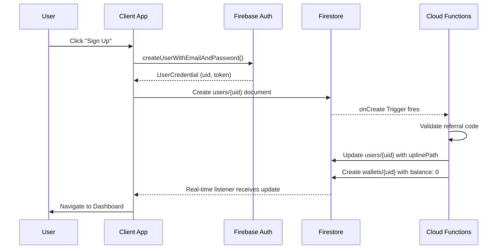

### Edge Cases

| Scenario | Behavior | Resolution |
|:---------|:---------|:-----------|
| **Duplicate Email** | Firebase rejects with `auth/email-already-in-use` | Show "Email exists, try logging in" |
| **Expired Token** | SDK auto-refreshes via Refresh Token | Seamless to user |
| **Revoked Refresh Token** | SDK throws `auth/user-token-expired` | Force re-login |
| **Invalid Referral Code** | Cloud Function rejects signup | Return `failed-precondition` |
| **Network Timeout on Signup** | User profile created but wallet missing | `onWrite` trigger retries; Orphan cleanup job runs daily |

### Failure Modes & Safeguards

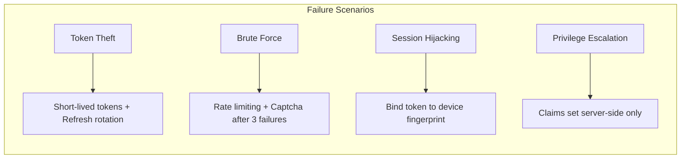

### Engineering Tradeoffs

| Decision | Alternative | Why We Chose This |
|:---------|:------------|:------------------|
| **Firebase Auth over Auth0** | Auth0 has richer enterprise features | Firebase integrates natively with Firestore Rules; reduces latency |
| **Custom Claims for Roles** | Store roles only in Firestore | Claims are checked at the edge (Security Rules) without DB read |
| **No MFA for Regular Users** | Require MFA for all | UX friction for low-value accounts; MFA required for Admin only |

### Scalability Implications
- **Stateless Sessions**: No session store to scale. JWT verification is CPU-bound, not I/O-bound.
- **Global Replication**: Firebase Auth is globally distributed; login latency is <100ms worldwide.
- **Bottleneck**: Custom Claims updates require token refresh (up to 1 hour delay or force refresh).

---

## 2. Hierarchical Referral System (MLM Engine)

### Purpose
To drive organic, viral growth through a gamified, multi-level marketing structure where users earn commissions from their direct referrals and extended downline activities. This is the **core growth flywheel** of the platform.

### System Design

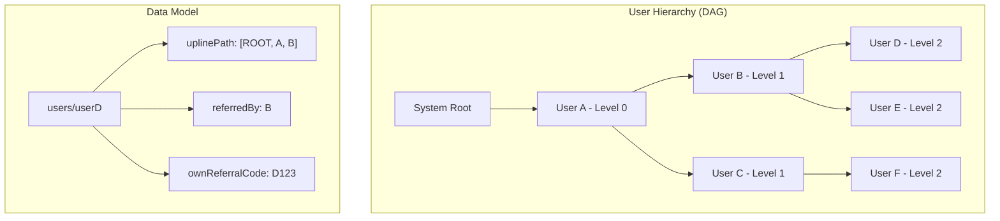

### Internal Behavior

**Materialized Path Pattern**: Instead of traversing the tree on every commission calculation (expensive), we store the complete ancestry path on each user document.

```typescript
// User D's document
{
  uid: "userD",
  referredBy: "userB",
  referralCode: "USERC_REF_CODE", // Used to find referrer
  ownReferralCode: "USERD_REF_CODE", // For D's own referrals
  uplinePath: ["ROOT", "userA", "userB"], // Materialized ancestors
  level: 2 // Depth in tree
}
```

**Commission Distribution Algorithm**:

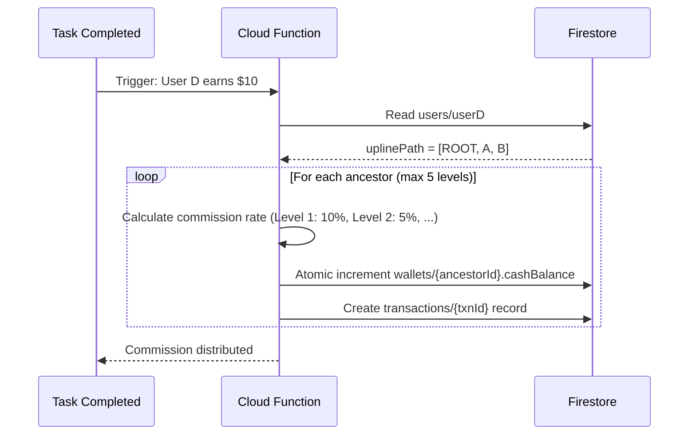

### Data Flow

| Event | Trigger | Affected Entities | Consistency |
|:------|:--------|:------------------|:------------|
| **User Signs Up** | `users.onCreate` | `users/{uid}`, `wallets/{uid}`, `teams/{referrerId}` | Strong |
| **Task Completion** | `task_completions.onCreate` | `wallets/{uid}`, `wallets/{ancestors[]}`, `transactions/*` | Strong (Transaction) |
| **Referral Bonus** | `users.onCreate` (if referred) | `wallets/{referrerId}` | Eventually consistent (queued) |

### Edge Cases

| Scenario | Risk | Mitigation |
|:---------|:-----|:-----------|
| **Self-Referral** | User refers themselves using alt email | Referral code validation checks IP + Device ID at signup |
| **Circular Reference** | A refers B, B refers A | Impossible by design (chronological registration enforces DAG) |
| **Orphan Account** | Referrer deletes their account | Orphan reparenting job assigns to system root |
| **Referral Code Collision** | Two users get same code | Codes are UUIDs; collision probability < 1e-37 |
| **Mass Registration Bot** | Bot creates fake downline | Captcha + App Check + Delayed commission unlock (7-day hold) |

### Failure Modes

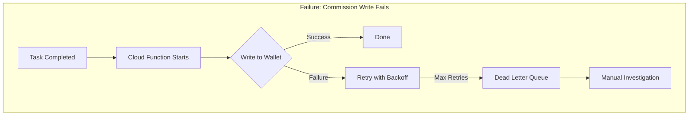

### Safeguards

1. **Idempotency**: Commission processor checks `processed_keys` collection before executing.
2. **Rate Limiting**: Max 100 task completions per user per day.
3. **Fraud Detection**: ML model flags accounts with suspicious downline signup patterns.
4. **Audit Trail**: Every commission has a `refId` linking to the source event.

### Engineering Tradeoffs

| Decision | Pro | Con | Justification |
|:---------|:----|:----|:--------------|
| **Materialized Path** | O(1) upline lookup | O(N) reparenting | Reparenting is rare (<0.01% of ops) |
| **5-Level Limit** | Bounded commission cost | Limits deep incentives | Industry standard; prevents pyramid collapse |
| **Firestore over Graph DB** | Operational simplicity | Complex traversals are hard | We don't need arbitrary traversals; only ancestor walks |

### Scalability Implications

- **Write Amplification**: A single task completion writes to 1-5 ancestor wallets. At 1M daily completions, expect 3M wallet writes.
- **Hotspot Risk**: "Super Leaders" with 100K+ downlines could become write hotspots. Mitigated via **Sharded Counters** for their aggregate stats.

---

## 3. Dual-Ledger Digital Wallet

### Purpose
To manage user earnings with **accounting-grade precision**, separating "withdrawable cash" from "platform loyalty coins." The wallet is the **financial heart** of ThinkMart—every feature touches it.

### System Design

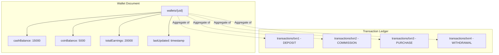

### Internal Behavior: Double-Entry Accounting

Every balance change follows the **immutable ledger principle**:

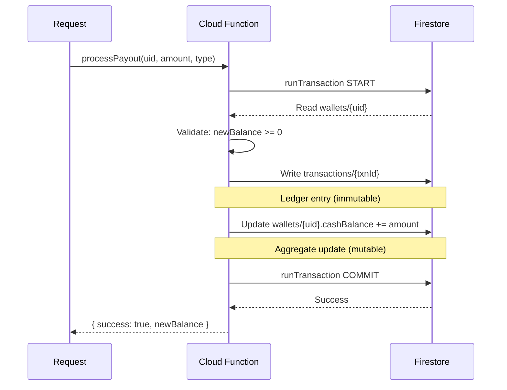

### Transaction Schema

```typescript
interface Transaction {
  id: string;                    // Auto-generated
  userId: string;                // FK to users
  type: 'DEPOSIT' | 'WITHDRAWAL' | 'COMMISSION' | 'PURCHASE' | 'REFUND' | 'BONUS';
  amount: number;                // Always positive
  direction: 'CREDIT' | 'DEBIT';
  currency: 'CASH' | 'COIN';
  referenceId: string;           // Source (orderId, taskId, etc.)
  referenceType: string;         // 'ORDER' | 'TASK' | 'REFERRAL'
  description: string;
  balanceAfter: number;          // Snapshot for auditing
  idempotencyKey: string;        // Prevents double-processing
  createdAt: Timestamp;
  metadata: Record<string, any>; // Extensible
}
```

### Data Flow

```mermaid
flowchart LR
    subgraph "Inflows (Credits)"
        I1[Task Reward] --> W
        I2[Commission] --> W
        I3[Referral Bonus] --> W
        I4[Admin Deposit] --> W
    end
    
    subgraph "Wallet"
        W[wallets/{uid}]
    end
    
    subgraph "Outflows (Debits)"
        W --> O1[Product Purchase]
        W --> O2[Withdrawal Request]
        W --> O3[Subscription Fee]
    end
```

### Edge Cases

| Scenario | Problem | Solution |
|:---------|:--------|:---------|
| **Double Spend** | Two requests try to spend last $10 simultaneously | `runTransaction` ensures atomic read-check-write |
| **Negative Balance** | Bug allows overdraft | Precondition in transaction: `if (balance - amount < 0) throw` |
| **Partial Failure** | Write succeeds to txn but fails to wallet | Transaction is atomic; both succeed or both fail |
| **Replay Attack** | Attacker resends successful withdrawal request | `idempotencyKey` check in `processed_keys` collection |
| **Currency Mismatch** | Try to pay in Coins when Cash required | Type check at application layer before transaction |

### Failure Modes

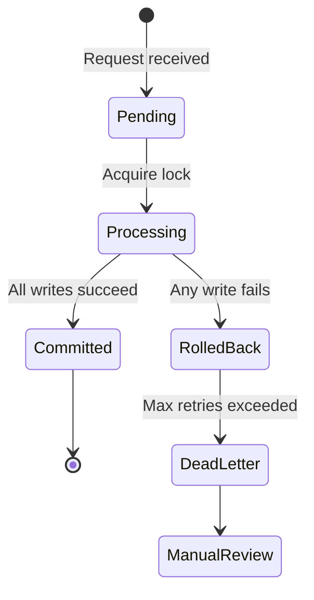

### Safeguards

1. **Immutable Ledger**: `transactions` collection has `allow delete: if false` in Security Rules.
2. **Balance Invariant**: `SUM(credits) - SUM(debits) == currentBalance` verified by nightly reconciliation job.
3. **Withdrawal Limits**: Daily max: $500, Weekly max: $2000, Monthly max: $5000.
4. **Cooldown Period**: 24-hour hold after password change before withdrawal is allowed.

### Engineering Tradeoffs

| Decision | Trade-off |
|:---------|:----------|
| **Integer Cents (not Float)** | No floating-point precision errors; slightly harder to display |
| **Snapshot `balanceAfter`** | Denormalized but enables instant balance history without aggregation |
| **Single Wallet Doc** | Simple reads but limits write throughput to 1/sec per user |

### Scalability Implications

- **Write Contention**: Active earners doing 10+ tasks/hour may hit wallet write limits. Solution: **Batch credits every 5 minutes** instead of immediate writes.
- **Audit Query Performance**: `transactions` collection will grow to billions of documents. Solution: **TTL-based archival to BigQuery** after 90 days.

---

## 4. E-Commerce Engine

### Purpose
A full-featured marketplace allowing users to spend their earnings or external currency on physical and digital goods. The marketplace is a **liquidity sink** for platform currency.

### System Design

```mermaid
flowchart TD
    subgraph "Product Catalog"
        PC[products/{productId}]
        PC --> N[name]
        PC --> P[price]
        PC --> I[inventory]
        PC --> IMG[images[]]
        PC --> CAT[category]
    end
    
    subgraph "Order Lifecycle"
        O1[CREATED] --> O2[PAID]
        O2 --> O3[PROCESSING]
        O3 --> O4[SHIPPED]
        O4 --> O5[DELIVERED]
        O2 --> O6[CANCELLED]
        O5 --> O7[REFUNDED]
    end
    
    subgraph "Cart Session"
        C[Client-Side Cart]
        C --> CI["items: [{productId, qty}]"]
    end
```

### Internal Behavior: Checkout Flow

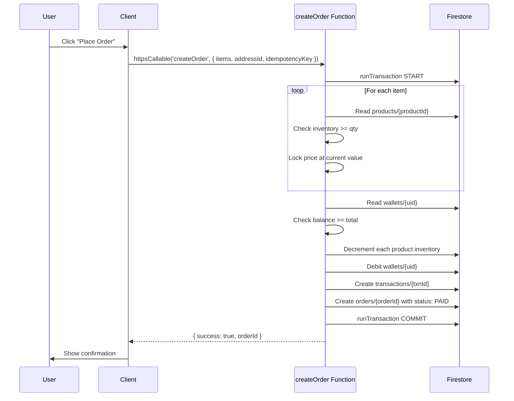

### Data Flow

| Phase | Data Movement | Consistency |
|:------|:--------------|:------------|
| **Browse** | Client ← Firestore (products) | Cached, eventually consistent |
| **Add to Cart** | Client state only | N/A |
| **Checkout** | Client → Cloud Function → Firestore | Strongly consistent (transaction) |
| **Fulfillment** | Admin updates order status | Eventually consistent to client |

### Edge Cases

| Scenario | Solution |
|:---------|:---------|
| **Out of Stock During Checkout** | Transaction fails; user sees "Item no longer available" |
| **Price Changed During Checkout** | Lock price at order creation; honor locked price |
| **Payment Succeeds, Order Write Fails** | Atomic transaction; cannot happen |
| **User Cancels After Payment** | Initiate refund flow; revert inventory |
| **Shipping Address Invalid** | Validate address format before transaction; reject invalid |

### Failure Modes

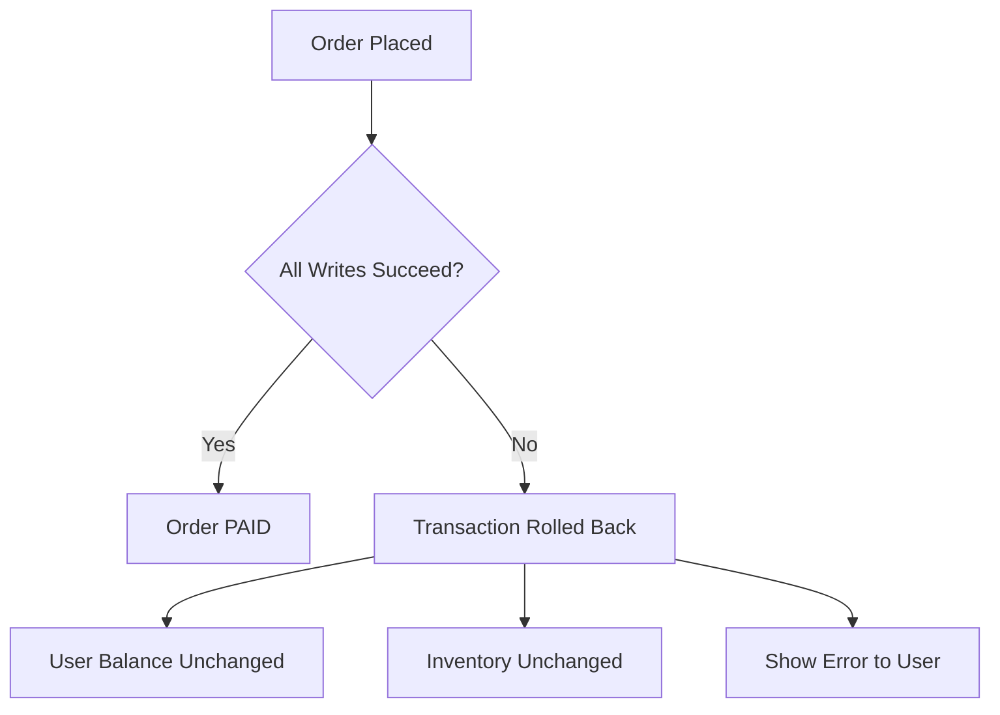

### Engineering Tradeoffs

| Choice | Benefit | Cost |
|:-------|:--------|:-----|
| **Optimistic Inventory** | No locking delays | Rare overselling on flash sales (handled by waitlist) |
| **Client-Side Cart** | No cart-abandonment cleanup | Cart lost on logout |
| **Price Snapshot in Order** | Immutable audit trail | Slight data duplication |

---

## 5. Task & Survey Validation Engine

### Purpose
To monetize user attention by validating interactions with third-party ads, links, or surveys. Tasks are the **primary earning mechanism** for non-referral income.

### System Design

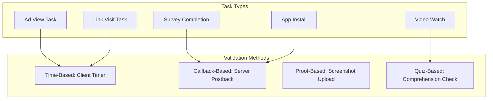

### Internal Behavior

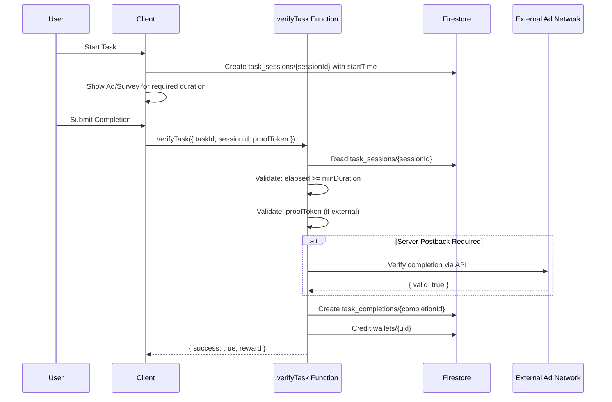

### Edge Cases

| Scenario | Detection | Response |
|:---------|:----------|:---------|
| **Speed Hacking** | `serverTime - startTime < minDuration` | Reject; log suspicious activity |
| **Replay Attack** | `task_completions` already contains `(userId, taskId, date)` | Reject; already completed today |
| **Bot Automation** | Velocity > 50 tasks/hour | Auto-lock account; manual review |
| **Invalid Postback** | External API returns `{ valid: false }` | Reject; no reward |

### Safeguards

1. **Server-Side Time**: All duration checks use `FieldValue.serverTimestamp()`, not client time.
2. **Daily Limits**: Max tasks per category per day (e.g., 10 ad views, 5 surveys).
3. **Cooling Period**: 60-second gap between starting two tasks.
4. **Fraud Scoring**: Users with high reject rates get flagged.

---

## 6. Real-Time Notification System

### Purpose
To keep users engaged through instant feedback on earnings, orders, and system events.

### System Design

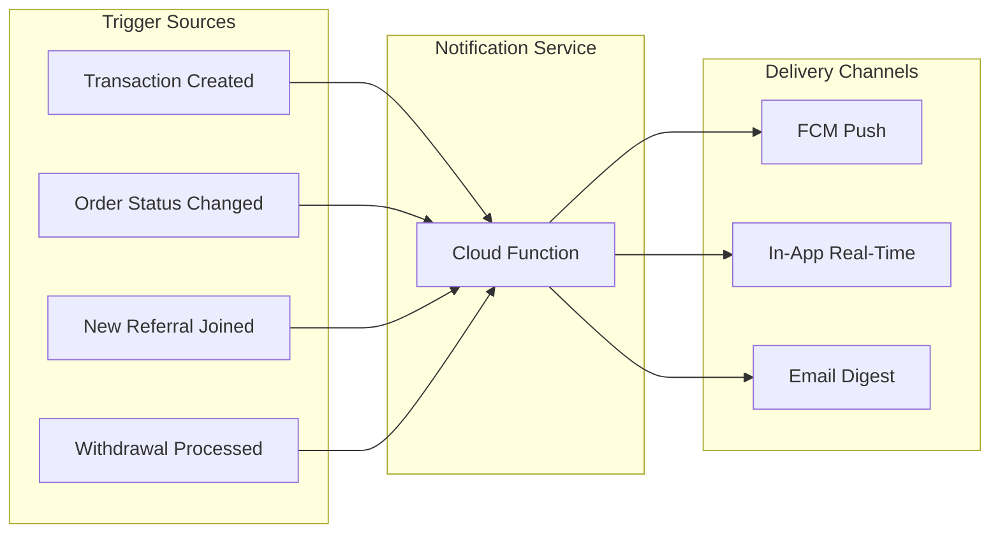

### Internal Behavior

| Event | Notification Type | Delivery | Template |
|:------|:------------------|:---------|:---------|
| `transaction.created (COMMISSION)` | Push + In-App | Immediate | "You earned $X from {referralName}'s activity!" |
| `order.status = SHIPPED` | Push + Email | Immediate | "Your order #{orderId} has shipped!" |
| `withdrawal.status = COMPLETED` | Push + Email | Immediate | "Your withdrawal of $X is complete." |
| `user.created (referral)` | Push | Immediate | "Welcome {name} to your team!" |

---

## 7. Administrative Control Plane

### Purpose
To enable platform operators to manage users, products, payouts, and system health without developer intervention.

### Capabilities

| Function | Access | Audit |
|:---------|:-------|:------|
| **User Management** | View/Edit profiles, Suspend accounts | All actions logged |
| **Wallet Adjustments** | Manual credit/debit (e.g., refunds) | Requires reason; double-approval for >$100 |
| **Product Management** | CRUD products, Inventory adjustments | Version history maintained |
| **Withdrawal Approval** | Approve/Reject pending withdrawals | Logged with operator ID |
| **Analytics Dashboard** | GMV, Daily Active Users, Conversion | Read-only |

### Safeguards

- **RBAC**: Fine-grained permissions (e.g., `admin:wallet:read` vs `admin:wallet:write`).
- **Audit Log**: Every admin action writes to `audit_logs/{logId}` with `operatorId`, `action`, `before`, `after`.
- **Rate Limiting**: Admin APIs limited to 100 req/min per operator.

---

## Architectural Signals of Maturity

| Signal | Evidence | Why It Matters |
|:-------|:---------|:---------------|
| **Immutable Audit Trail** | `transactions` collection with `allow delete: if false` | Regulatory compliance; dispute resolution |
| **Idempotent Operations** | `idempotencyKey` on all financial mutations | Safe retries; prevents double-spending |
| **Event-Driven Architecture** | Firestore Triggers for side-effects | Decoupled services; independent scaling |
| **Optimistic UI with Rollback** | Client assumes success; reverts on failure | Snappy UX without sacrificing correctness |
| **Defense in Depth** | Security Rules + Function Validation + Zod Schemas | No single point of failure in validation |
| **Materialized Paths** | `uplinePath` array for O(1) ancestry | Performance at scale |
| **Serverless-First** | No persistent servers to manage | Operational simplicity; infinite scale |

---

## Product Philosophy

### The ThinkMart Thesis

ThinkMart is not an e-commerce platform with gamification bolted on. It is an **economic participation engine** built on three pillars:

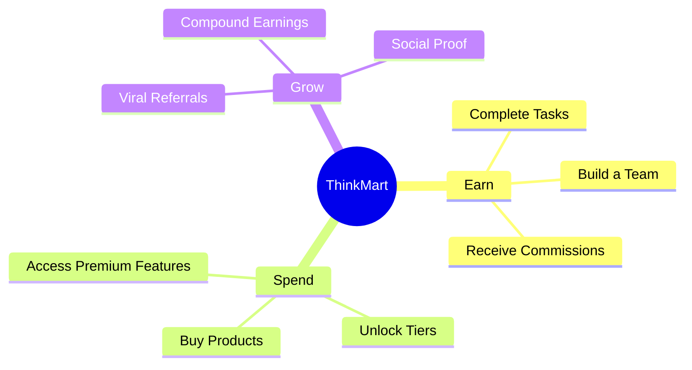

### Design Philosophy

1. **Every User is a Distributor**: We don't have "customers" and "sellers." Every user can earn by bringing others.

2. **Liquidity is Sacred**: Earned money must be spendable (marketplace) OR withdrawable (payout). Dead-end tokens kill engagement.

3. **Trust Through Transparency**: Real-time wallet updates, visible transaction history, and instant notifications create trust.

4. **Progressive Disclosure**: New users see simple earning. Power users unlock team analytics, tier progression, and advanced tools.

5. **Safety Over Speed**: We will delay a feature launch to get the financial logic right. A lost cent is a lost user.

### Success Metrics

| Metric | Target | Why |
|:-------|:-------|:----|
| **D7 Retention** | > 40% | Users who complete 1 task in first 7 days |
| **Referral Rate** | > 15% | % of users who bring at least 1 referral |
| **Withdrawal Success Rate** | > 99.9% | Payouts completed without issue |
| **Support Ticket Volume** | < 1% of DAU | Low confusion = good UX |

---

*This document is the source of truth for ThinkMart's implemented capabilities. All feature additions must be documented here before launch.*
