# System Architecture

> **Document Version**: 2.0  
> **Last Updated**: January 2026  
> **Audience**: Staff Engineers, Architects, Technical Leadership

---

## Table of Contents
1. [High-Level Architecture](#high-level-architecture)
2. [Service Boundaries](#service-boundaries)
3. [Monolith vs Microservices Analysis](#monolith-vs-microservices-analysis)
4. [Request Lifecycle](#request-lifecycle)
5. [Concurrency Model](#concurrency-model)
6. [Consistency Model](#consistency-model)
7. [Caching Strategy](#caching-strategy)
8. [Background Processing](#background-processing)
9. [Idempotency Strategy](#idempotency-strategy)
10. [Failure Recovery Patterns](#failure-recovery-patterns)
11. [Architectural Tradeoffs](#architectural-tradeoffs)

---

## High-Level Architecture

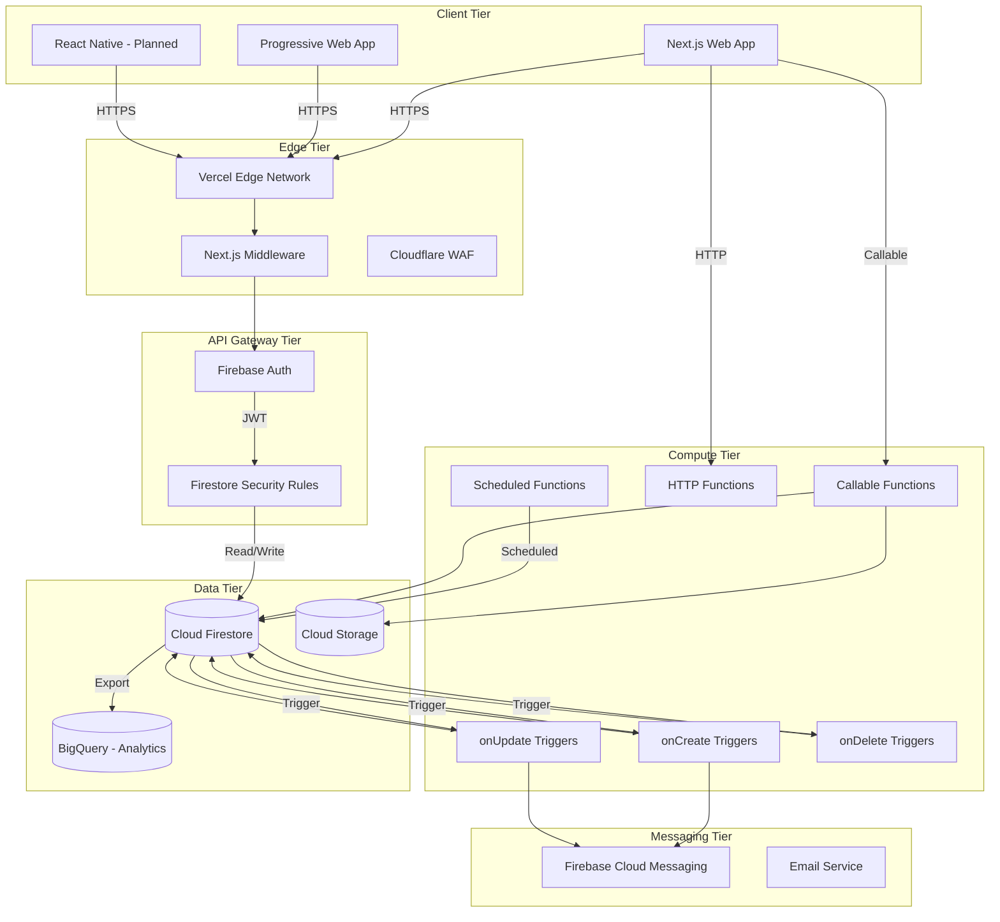

### Component Descriptions

| Component | Technology | Purpose |
|:----------|:-----------|:--------|
| **Web Client** | Next.js 14 (App Router) | Server-Rendered React with Edge capabilities |
| **Edge Network** | Vercel Edge | Global CDN, automatic HTTPS, DDoS protection |
| **Identity** | Firebase Auth | OAuth, Email/Password, Session management |
| **Authorization** | Firestore Security Rules | Declarative access control |
| **Compute** | Cloud Functions Gen 2 | Serverless event handlers |
| **Database** | Cloud Firestore | Real-time NoSQL document store |
| **Blob Storage** | Cloud Storage | User uploads, proof screenshots |
| **Push** | Firebase Cloud Messaging | Cross-platform push notifications |

---

## Service Boundaries

### Domain Decomposition

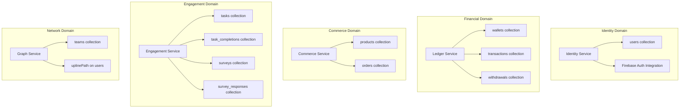

### Service Responsibility Matrix

| Service | Owns | Reads From | Writes To | Triggers |
|:--------|:-----|:-----------|:----------|:---------|
| **Identity** | `users` | - | `users`, `wallets` | `users.onCreate` |
| **Ledger** | `wallets`, `transactions`, `withdrawals` | `users` | `wallets`, `transactions` | `task_completions.onCreate`, `orders.onCreate` |
| **Commerce** | `products`, `orders` | `wallets` | `orders`, `wallets` | `orders.onUpdate` |
| **Engagement** | `tasks`, `task_completions`, `surveys` | `users` | `task_completions` | Callable: `verifyTask` |
| **Graph** | `teams`, `uplinePath` logic | `users` | `users`, `wallets` | `users.onCreate`, `task_completions.onCreate` |

### Cross-Service Communication

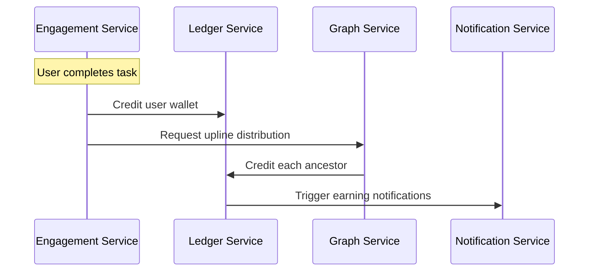

---

## Monolith vs Microservices Analysis

### Current State: Modular Serverless Monolith

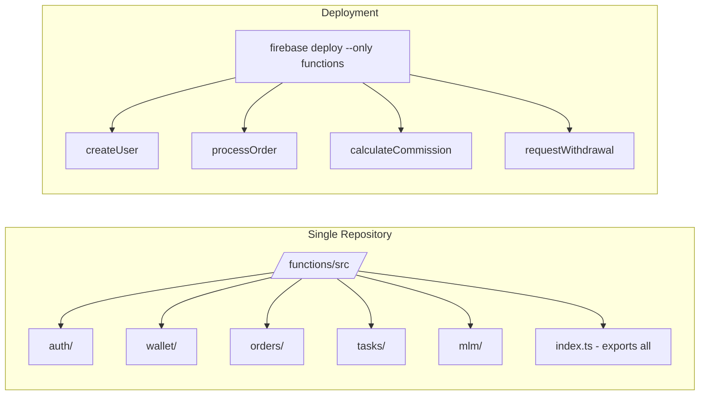

### Decision Matrix

| Factor | Monolith | Modular Monolith (Current) | Full Microservices |
|:-------|:---------|:---------------------------|:-------------------|
| **Deployment Complexity** | ✅ Simple | ✅ Simple | ❌ Complex |
| **Independent Scaling** | ❌ No | ✅ Per-function | ✅ Per-service |
| **Team Autonomy** | ✅ Full | ✅ Full (module owners) | ✅ Full |
| **Operational Overhead** | ✅ Low | ✅ Low | ❌ High |
| **Cold Start Impact** | ❌ All code loads | ✅ Only function loads | ✅ Isolated |
| **Testing Complexity** | ✅ Simple | ✅ Simple | ❌ Integration hell |

### Why Modular Serverless Monolith?

1. **Right Size for Stage**: We have <10 engineers. Microservices operational burden is not justified.
2. **Firebase Native**: The functions framework naturally encourages small, focused functions.
3. **Escape Hatch Ready**: Each module can become a separate service when needed (clear boundaries).
4. **Shared Types**: TypeScript interfaces are shared across modules without versioning headaches.

---

## Request Lifecycle

### Example: User Places an Order

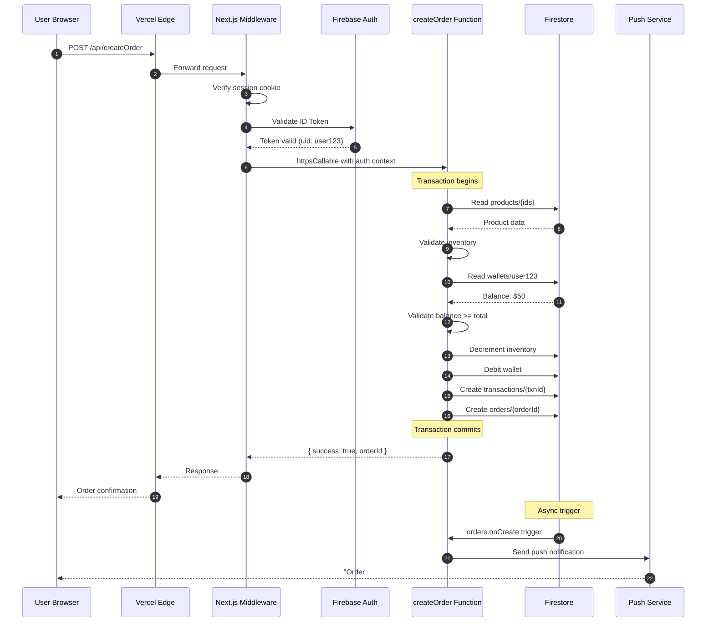

### Latency Budget

| Phase | Target | Reality |
|:------|:-------|:--------|
| Edge → Middleware | <20ms | 10-15ms |
| Auth Validation | <50ms | 30-40ms |
| Function Cold Start | <500ms | 200-2000ms (depends on instance state) |
| Firestore Transaction | <200ms | 100-150ms |
| Total P95 | <1000ms | 500-800ms (warm) |

---

## Concurrency Model

### The Problem: Double Spending

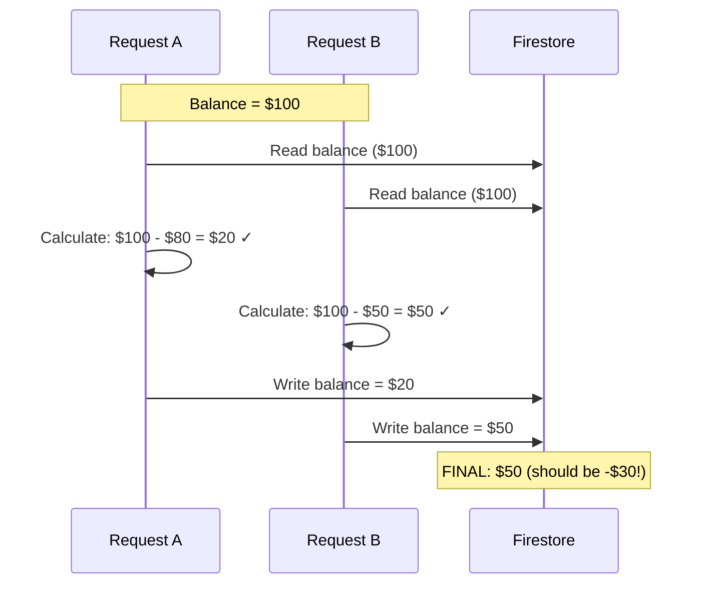

### The Solution: Optimistic Concurrency Control

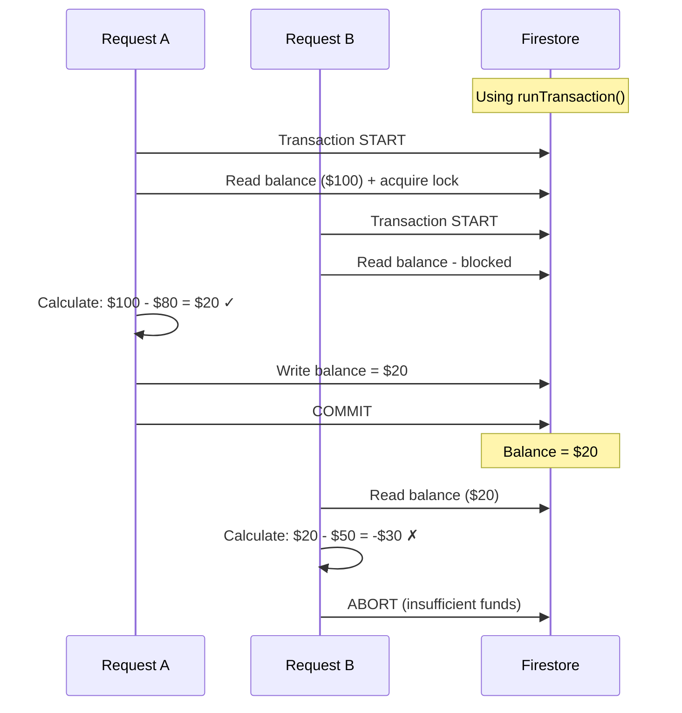

### Implementation Pattern

```typescript
// All financial mutations use this pattern
async function debitWallet(uid: string, amount: number, idempotencyKey: string) {
  return firestore.runTransaction(async (txn) => {
    // Check idempotency
    const keyRef = db.collection('processed_keys').doc(idempotencyKey);
    const keySnap = await txn.get(keyRef);
    if (keySnap.exists) {
      return keySnap.data().result; // Return cached result
    }
    
    // Read current balance
    const walletRef = db.collection('wallets').doc(uid);
    const walletSnap = await txn.get(walletRef);
    const balance = walletSnap.data().cashBalance;
    
    // Validate
    if (balance < amount) {
      throw new functions.https.HttpsError('failed-precondition', 'Insufficient balance');
    }
    
    // Write new balance + ledger entry + idempotency key
    const newBalance = balance - amount;
    txn.update(walletRef, { cashBalance: newBalance });
    txn.set(db.collection('transactions').doc(), { /* ... */ });
    txn.set(keyRef, { result: { success: true, newBalance }, processedAt: FieldValue.serverTimestamp() });
    
    return { success: true, newBalance };
  });
}
```

---

## Consistency Model

### Hybrid Approach

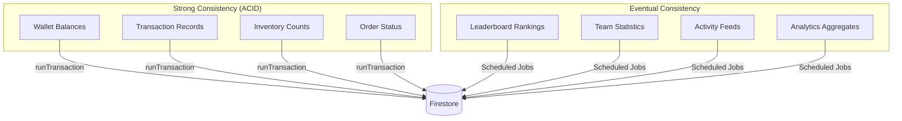

### Justification

| Data Type | Consistency | Why |
|:----------|:------------|:----|
| **Wallet Balance** | Strong | User cannot see money they don't have |
| **Inventory** | Strong | Cannot sell item that doesn't exist |
| **Leaderboard** | Eventual (60s lag) | Acceptable; reduces write contention |
| **Team Sales Total** | Eventual (5m lag) | Statistical; not transactional |

---

## Caching Strategy

### Cache Layers

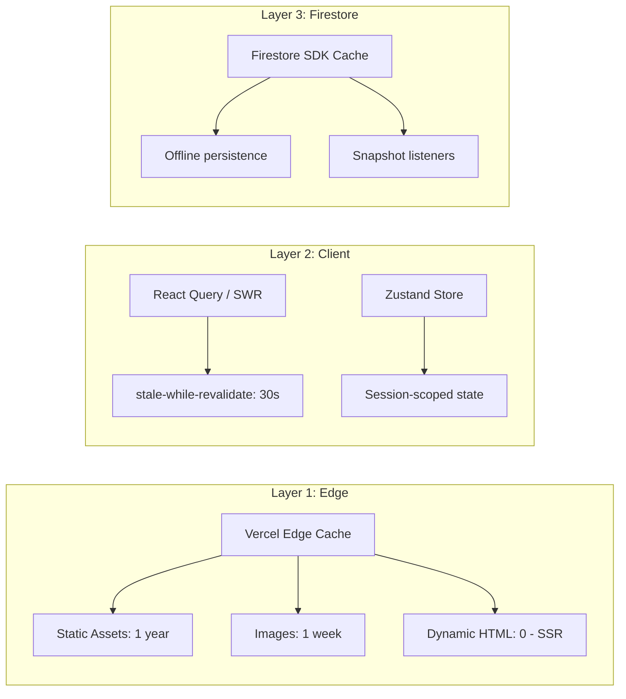

### Cache Policy by Data Type

| Data | Cache Location | TTL | Invalidation |
|:-----|:---------------|:----|:-------------|
| **Product Images** | CDN | 7 days | Cache-bust on upload |
| **Product Catalog** | React Query | 5 min | Manual refetch on admin update |
| **User Profile** | Zustand + Firestore | Session | Real-time listener |
| **Wallet Balance** | Firestore Listener | Real-time | Automatic |
| **Transaction History** | React Query | 1 min | Refetch on navigation |

---

## Background Processing

### Job Types

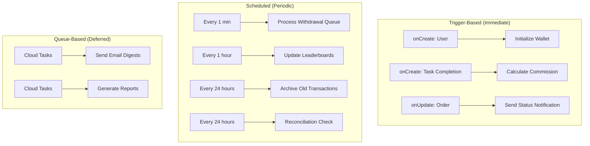

### Job Configuration

| Job | Trigger | Retry Policy | Timeout | Min Instances |
|:----|:--------|:-------------|:--------|:--------------|
| `initializeWallet` | `users.onCreate` | 3 retries, exponential backoff | 30s | 0 |
| `calculateCommission` | `task_completions.onCreate` | 5 retries | 60s | 1 |
| `processWithdrawals` | Scheduled (1 min) | N/A | 540s | 1 |
| `updateLeaderboards` | Scheduled (1 hour) | N/A | 540s | 0 |

---

## Idempotency Strategy

### Why It Matters

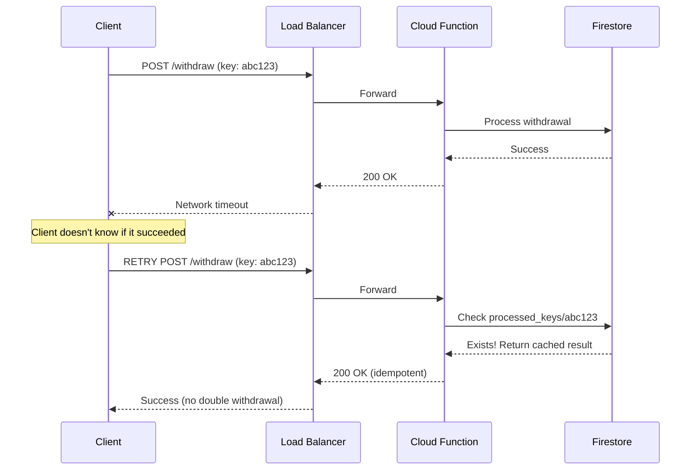

### Implementation

```typescript
// Idempotency key pattern
interface IdempotencyRecord {
  key: string;              // UUID from client
  operation: string;        // 'WITHDRAWAL' | 'ORDER' | etc.
  result: any;              // Cached response
  processedAt: Timestamp;
  expiresAt: Timestamp;     // 24-hour TTL
}

// Collection: processed_keys/{idempotencyKey}
```

### Key Generation Rules

| Operation | Key Format | Client Responsibility |
|:----------|:-----------|:----------------------|
| **Withdrawal** | `wd-{uid}-{timestamp}-{random}` | Generate once, retry with same key |
| **Order** | `ord-{uid}-{cartHash}-{random}` | Same cart = same key |
| **Task Completion** | `tc-{uid}-{taskId}-{date}` | Automatic dedup per day |

---

## Failure Recovery Patterns

### Circuit Breaker (External APIs)

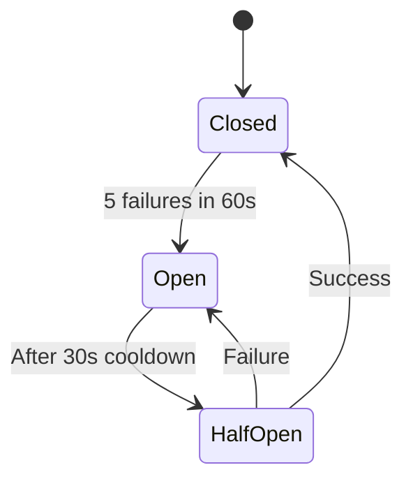

### Dead Letter Queue

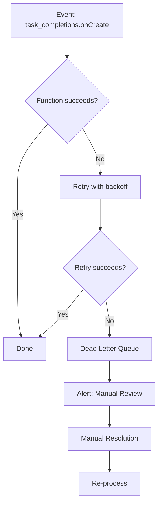

### Saga Pattern (Multi-Step Workflows)

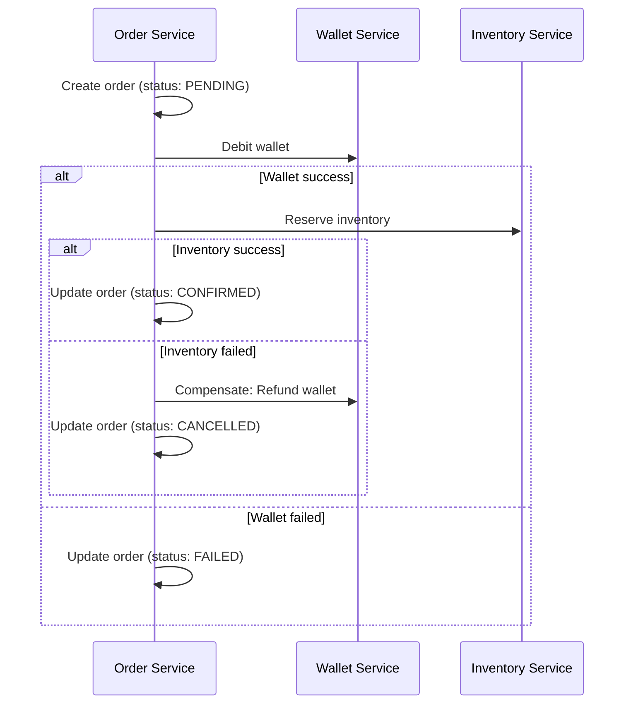

---

## Architectural Tradeoffs

### Decision Log

| Decision | Alternatives Considered | Why This Choice | Tradeoff Accepted |
|:---------|:------------------------|:----------------|:------------------|
| **Firestore over Postgres** | Supabase, PlanetScale | Real-time sync, serverless, infinite scale | Complex queries are limited |
| **Cloud Functions over ECS** | AWS Lambda, Cloud Run | Firebase integration, auto-scaling | Cold starts on infrequent paths |
| **Vercel over Amplify** | Firebase Hosting, Netlify | Best Next.js support, preview deploys | Vendor lock-in |
| **Materialized Path over Graph DB** | Neo4j, Neptune | Simple reads, no new tech to manage | Reparenting is expensive |
| **Client-Side Cart** | Server-Side Cart | No abandoned cart cleanup needed | Cart lost on logout |
| **JWT over Sessions** | Redis sessions | Stateless, edge-verifiable | Harder to revoke |

### Technical Debt Acknowledgment

| Debt Item | Impact | Remediation Plan |
|:----------|:-------|:-----------------|
| **Gen1 Functions** | Higher cold starts | Migrate to Gen2 in Q2 |
| **No Message Queue** | Tight coupling | Add Pub/Sub for v2 |
| **Monolithic Index File** | IDE slowdown | Split into barrel exports |
| **No API Rate Limiting** | Abuse risk | Add Cloud Armor rules |

---

*This architecture document is the source of truth for system design decisions. All significant changes require RFC and review.*
