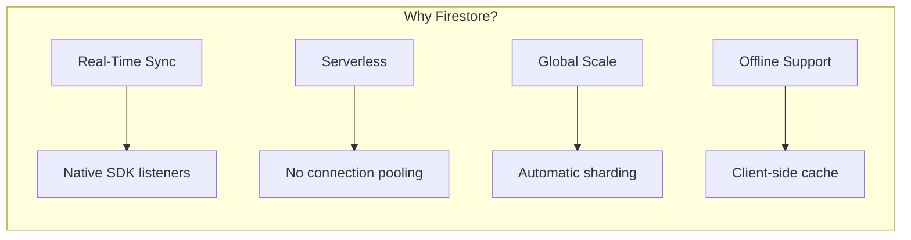
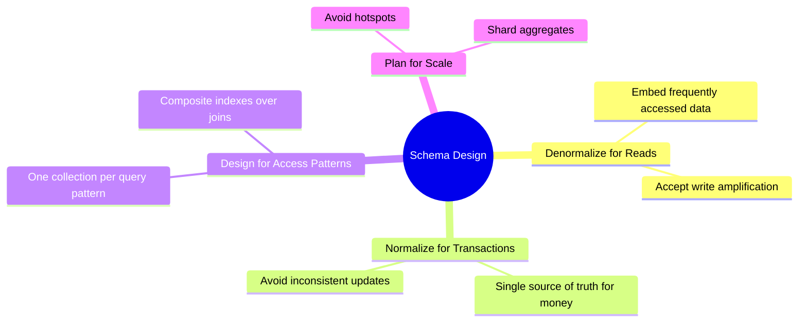
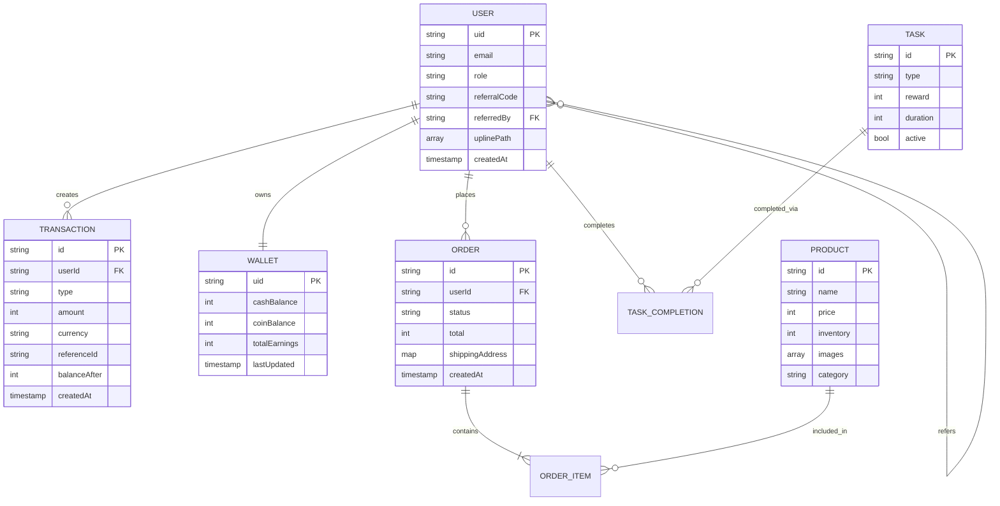
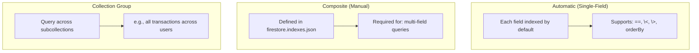
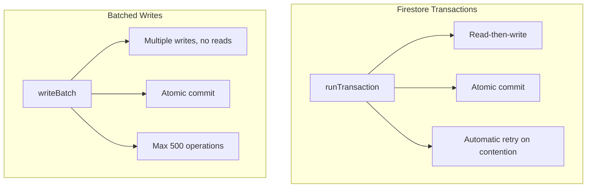
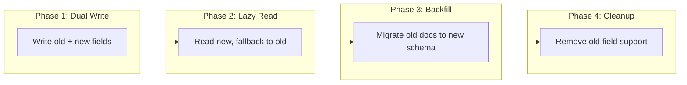
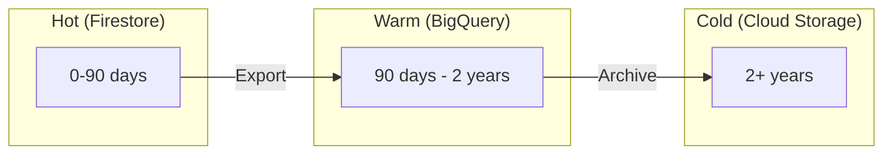
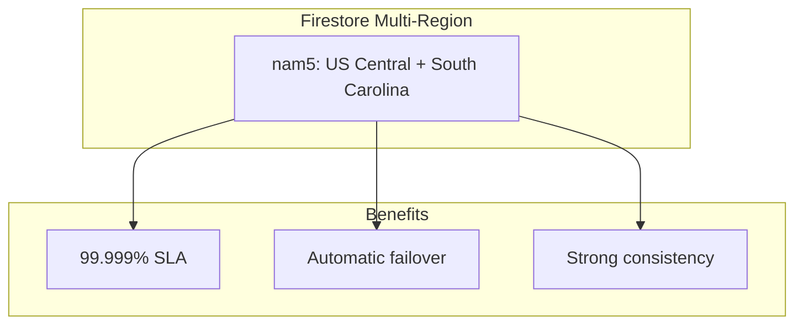
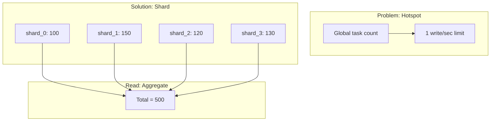

# Database Design

> **Document Version**: 2.0  
> **Last Updated**: January 2026  
> **Audience**: Backend Engineers, Data Engineers, DBAs

---

## Table of Contents
1. [Database Strategy](#database-strategy)
2. [Schema Design Philosophy](#schema-design-philosophy)
3. [Core Entities](#core-entities)
4. [Indexing Strategy](#indexing-strategy)
5. [Query Patterns](#query-patterns)
6. [Transaction Strategy](#transaction-strategy)
7. [Data Integrity Guarantees](#data-integrity-guarantees)
8. [Migration Strategy](#migration-strategy)
9. [Archival Strategy](#archival-strategy)
10. [Multi-Region Considerations](#multi-region-considerations)
11. [Sharding & Partitioning Plan](#sharding--partitioning-plan)

---

## Database Strategy

### Primary Database: Cloud Firestore



### Database Comparison

| Requirement | Firestore | PostgreSQL | MongoDB | DynamoDB |
|:------------|:----------|:-----------|:--------|:---------|
| **Real-time sync** | ✅ Native | ❌ Requires Hasura | ❌ Change streams | ❌ Requires DDB Streams |
| **Serverless** | ✅ Native | ⚠️ Supabase/Neon | ⚠️ Atlas Serverless | ✅ Native |
| **Complex queries** | ⚠️ Limited | ✅ Full SQL | ✅ Aggregation pipeline | ⚠️ Limited |
| **Transactions** | ✅ ACID | ✅ ACID | ✅ Multi-doc | ⚠️ Limited |
| **Firebase integration** | ✅ Native | ❌ None | ❌ None | ❌ None |

### Decision Justification

**We chose Firestore because:**
1. **Real-time wallet updates** are core UX—Firestore provides this natively.
2. **Firebase Auth integration** means no custom session handling.
3. **Serverless model** means no connection pool exhaustion.
4. **Offline-first** SDK enables progressive web app capabilities.

**Accepted Tradeoffs:**
- Complex analytics queries go to BigQuery (export pipeline).
- Full-text search requires Algolia/Typesense integration.

---

## Schema Design Philosophy

### Core Principles



### Document Sizing Guidelines

| Collection | Avg Doc Size | Max Doc Size | Notes |
|:-----------|:-------------|:-------------|:------|
| `users` | 2 KB | 10 KB | Includes uplinePath array |
| `wallets` | 500 B | 1 KB | Minimal, high-frequency updates |
| `transactions` | 1 KB | 2 KB | Immutable after creation |
| `orders` | 3 KB | 20 KB | Includes item snapshots |
| `products` | 5 KB | 50 KB | Includes image URLs, descriptions |

---

## Core Entities

### Entity Relationship Diagram



### Collection Schemas

#### `users/{uid}`

```typescript
interface User {
  // Identity
  uid: string;                    // Firebase Auth UID
  email: string;                  // Unique, indexed
  displayName: string;
  photoURL?: string;
  
  // Access Control
  role: 'user' | 'admin';
  verified: boolean;
  suspended: boolean;
  
  // Referral Graph
  ownReferralCode: string;        // Unique, indexed
  referralCode?: string;          // Code used at signup
  referredBy?: string;            // UID of referrer
  uplinePath: string[];           // [root, ..., parent] - Materialized Path
  level: number;                  // Depth in referral tree
  
  // Profile
  phone?: string;
  country?: string;
  
  // Timestamps
  createdAt: Timestamp;
  lastLoginAt: Timestamp;
  updatedAt: Timestamp;
}
```

#### `wallets/{uid}`

```typescript
interface Wallet {
  // Balances (stored as integer cents to avoid floating-point errors)
  cashBalance: number;            // Withdrawable balance in cents ($10.50 = 1050)
  coinBalance: number;            // Platform loyalty points
  
  // Aggregates (for display, not critical)
  totalEarnings: number;          // Lifetime earnings (monotonic)
  totalWithdrawn: number;         // Lifetime withdrawals
  
  // Metadata
  lastUpdated: Timestamp;
  version: number;                // Optimistic locking
}
```

#### `transactions/{txnId}`

```typescript
interface Transaction {
  id: string;                     // Auto-generated
  userId: string;                 // FK to users
  
  // Classification
  type: 'DEPOSIT' | 'WITHDRAWAL' | 'COMMISSION' | 'PURCHASE' | 'REFUND' | 'BONUS' | 'TASK_REWARD';
  direction: 'CREDIT' | 'DEBIT';
  currency: 'CASH' | 'COIN';
  
  // Amount
  amount: number;                 // Always positive (direction indicates sign)
  balanceAfter: number;           // Snapshot for audit trail
  
  // Reference
  referenceId: string;            // orderId, taskId, withdrawalId, etc.
  referenceType: 'ORDER' | 'TASK' | 'REFERRAL' | 'WITHDRAWAL' | 'ADMIN';
  
  // Audit
  description: string;
  idempotencyKey: string;         // For dedup
  createdAt: Timestamp;
  
  // Extensible
  metadata: Record<string, any>;
}
```

#### `orders/{orderId}`

```typescript
interface Order {
  id: string;
  userId: string;
  
  // Status
  status: 'PENDING' | 'PAID' | 'PROCESSING' | 'SHIPPED' | 'DELIVERED' | 'CANCELLED' | 'REFUNDED';
  
  // Items (denormalized snapshot)
  items: Array<{
    productId: string;
    productName: string;          // Snapshot at order time
    quantity: number;
    pricePerUnit: number;         // Price at order time
    subtotal: number;
  }>;
  
  // Totals
  subtotal: number;
  shippingCost: number;
  discount: number;
  total: number;
  paymentMethod: 'WALLET_CASH' | 'WALLET_COIN' | 'EXTERNAL';
  
  // Fulfillment
  shippingAddress: {
    name: string;
    line1: string;
    line2?: string;
    city: string;
    state: string;
    postalCode: string;
    country: string;
    phone: string;
  };
  trackingNumber?: string;
  carrier?: string;
  
  // Timestamps
  createdAt: Timestamp;
  paidAt?: Timestamp;
  shippedAt?: Timestamp;
  deliveredAt?: Timestamp;
}
```

#### `products/{productId}`

```typescript
interface Product {
  id: string;
  
  // Basic Info
  name: string;
  slug: string;                   // URL-friendly name
  description: string;
  shortDescription: string;
  
  // Pricing
  price: number;                  // Current price in cents
  compareAtPrice?: number;        // Original price for discounts
  
  // Inventory
  inventory: number;
  lowStockThreshold: number;
  trackInventory: boolean;
  
  // Categorization
  category: string;
  tags: string[];
  
  // Media
  images: Array<{
    url: string;
    alt: string;
    isPrimary: boolean;
  }>;
  
  // Status
  active: boolean;
  featured: boolean;
  
  // SEO
  metaTitle?: string;
  metaDescription?: string;
  
  // Timestamps
  createdAt: Timestamp;
  updatedAt: Timestamp;
}
```

#### `tasks/{taskId}`

```typescript
interface Task {
  id: string;
  
  // Classification
  type: 'AD_VIEW' | 'LINK_VISIT' | 'SURVEY' | 'APP_INSTALL' | 'VIDEO_WATCH';
  category: string;
  
  // Reward
  reward: number;                 // In cents
  rewardCurrency: 'CASH' | 'COIN';
  
  // Requirements
  minDuration: number;            // Seconds
  maxDuration: number;
  dailyLimit: number;             // Per user
  totalLimit?: number;            // Global limit
  
  // Content
  title: string;
  description: string;
  actionUrl: string;
  proofRequired: boolean;
  
  // Targeting
  countries: string[];            // Empty = all
  minLevel?: number;              // User level requirement
  
  // Status
  active: boolean;
  startsAt: Timestamp;
  endsAt?: Timestamp;
  
  // Tracking
  completionCount: number;        // Sharded counter reference
  
  createdAt: Timestamp;
  updatedAt: Timestamp;
}
```

#### `withdrawals/{withdrawalId}`

```typescript
interface Withdrawal {
  id: string;
  userId: string;
  
  // Amount
  amount: number;
  fee: number;
  netAmount: number;              // amount - fee
  
  // Payment Details
  method: 'BANK_TRANSFER' | 'PAYPAL' | 'USDT_TRC20';
  paymentDetails: {
    // Bank
    bankName?: string;
    accountNumber?: string;
    routingNumber?: string;
    
    // PayPal
    paypalEmail?: string;
    
    // Crypto
    walletAddress?: string;
    network?: string;
  };
  
  // Status
  status: 'PENDING' | 'PROCESSING' | 'COMPLETED' | 'REJECTED' | 'CANCELLED';
  rejectionReason?: string;
  
  // Processing
  transactionId?: string;         // FK to transactions
  externalRef?: string;           // Bank/PayPal/Blockchain ref
  processedBy?: string;           // Admin UID
  
  // Timestamps
  requestedAt: Timestamp;
  processedAt?: Timestamp;
}
```

---

## Indexing Strategy

### Index Types in Firestore



### Critical Composite Indexes

```json
// firestore.indexes.json (excerpt)
{
  "indexes": [
    {
      "collectionGroup": "transactions",
      "queryScope": "COLLECTION",
      "fields": [
        { "fieldPath": "userId", "order": "ASCENDING" },
        { "fieldPath": "createdAt", "order": "DESCENDING" }
      ]
    },
    {
      "collectionGroup": "orders",
      "queryScope": "COLLECTION",
      "fields": [
        { "fieldPath": "userId", "order": "ASCENDING" },
        { "fieldPath": "status", "order": "ASCENDING" },
        { "fieldPath": "createdAt", "order": "DESCENDING" }
      ]
    },
    {
      "collectionGroup": "task_completions",
      "queryScope": "COLLECTION",
      "fields": [
        { "fieldPath": "userId", "order": "ASCENDING" },
        { "fieldPath": "completedAt", "order": "DESCENDING" }
      ]
    },
    {
      "collectionGroup": "users",
      "queryScope": "COLLECTION",
      "fields": [
        { "fieldPath": "referredBy", "order": "ASCENDING" },
        { "fieldPath": "createdAt", "order": "DESCENDING" }
      ]
    }
  ]
}
```

### Index Management Best Practices

| Practice | Implementation |
|:---------|:---------------|
| **Version Control** | `firestore.indexes.json` in Git |
| **Deploy via CI** | `firebase deploy --only firestore:indexes` |
| **Monitor Size** | Check Firebase Console for index storage |
| **Audit Quarterly** | Remove unused indexes |

---

## Query Patterns

### Common Queries

```typescript
// Get user's recent transactions
db.collection('transactions')
  .where('userId', '==', uid)
  .orderBy('createdAt', 'desc')
  .limit(20);

// Get user's direct referrals
db.collection('users')
  .where('referredBy', '==', uid)
  .orderBy('createdAt', 'desc');

// Get user's downline (any level)
db.collection('users')
  .where('uplinePath', 'array-contains', uid);

// Get active products in category
db.collection('products')
  .where('active', '==', true)
  .where('category', '==', 'electronics')
  .orderBy('price', 'asc')
  .limit(20);

// Get pending withdrawals for admin
db.collection('withdrawals')
  .where('status', '==', 'PENDING')
  .orderBy('requestedAt', 'asc');
```

### Query Performance Guidelines

| Query Type | Expected Latency | Notes |
|:-----------|:-----------------|:------|
| **Single Doc Get** | <50ms | Fastest |
| **Indexed Query (20 docs)** | <100ms | Ideal for lists |
| **Array-Contains** | <150ms | Slightly slower |
| **OR Query (Compound)** | <200ms | Avoid if possible |
| **Full Collection Scan** | ❌ Never do this | Use pagination |

---

## Transaction Strategy

### Transaction Types



### Transaction Use Cases

| Operation | Method | Why |
|:----------|:-------|:----|
| **Wallet Debit** | `runTransaction` | Must read balance before writing |
| **Order Creation** | `runTransaction` | Inventory check + debit + create |
| **Bulk Status Update** | `writeBatch` | No conditional reads needed |
| **Daily Aggregation** | `writeBatch` | Update many docs atomically |

### Transaction Implementation

```typescript
// Safe wallet debit with idempotency
async function debitWallet(uid: string, amount: number, idempotencyKey: string) {
  return await db.runTransaction(async (transaction) => {
    // 1. Check idempotency
    const keyRef = db.doc(`processed_keys/${idempotencyKey}`);
    const keyDoc = await transaction.get(keyRef);
    if (keyDoc.exists) {
      return keyDoc.data()!.result;
    }
    
    // 2. Read wallet
    const walletRef = db.doc(`wallets/${uid}`);
    const walletDoc = await transaction.get(walletRef);
    const wallet = walletDoc.data() as Wallet;
    
    // 3. Validate
    if (wallet.cashBalance < amount) {
      throw new functions.https.HttpsError(
        'failed-precondition',
        'Insufficient balance'
      );
    }
    
    // 4. Calculate new state
    const newBalance = wallet.cashBalance - amount;
    const txnId = db.collection('transactions').doc().id;
    
    // 5. Write all changes atomically
    transaction.update(walletRef, {
      cashBalance: newBalance,
      lastUpdated: FieldValue.serverTimestamp()
    });
    
    transaction.set(db.doc(`transactions/${txnId}`), {
      userId: uid,
      type: 'DEBIT',
      amount,
      balanceAfter: newBalance,
      idempotencyKey,
      createdAt: FieldValue.serverTimestamp()
    });
    
    transaction.set(keyRef, {
      result: { success: true, newBalance, txnId },
      processedAt: FieldValue.serverTimestamp()
    });
    
    return { success: true, newBalance, txnId };
  });
}
```

---

## Data Integrity Guarantees

### Invariants

| Invariant | Enforcement | Verification |
|:----------|:------------|:-------------|
| `wallet.balance >= 0` | Transaction precondition | Nightly check |
| `SUM(txn.credits) - SUM(txn.debits) == balance` | Double-entry | Reconciliation job |
| `order.total == SUM(items.subtotal)` | Application logic | Audit script |
| `user.uplinePath` is valid DAG | Signup validation | Weekly graph check |

### Reconciliation Job

```typescript
// Runs daily at 3 AM UTC
export const reconcileWallets = functions.pubsub
  .schedule('0 3 * * *')
  .onRun(async () => {
    const wallets = await db.collection('wallets').get();
    
    for (const walletDoc of wallets.docs) {
      const wallet = walletDoc.data();
      const txns = await db.collection('transactions')
        .where('userId', '==', walletDoc.id)
        .get();
      
      let calculated = 0;
      for (const txn of txns.docs) {
        const t = txn.data();
        if (t.direction === 'CREDIT') calculated += t.amount;
        if (t.direction === 'DEBIT') calculated -= t.amount;
      }
      
      if (calculated !== wallet.cashBalance) {
        await alertOps({
          type: 'BALANCE_MISMATCH',
          userId: walletDoc.id,
          expected: calculated,
          actual: wallet.cashBalance,
          delta: calculated - wallet.cashBalance
        });
      }
    }
  });
```

---

## Migration Strategy

### Schema Evolution Pattern



### Migration Example

```typescript
// Adding a 'displayName' field to users

// Phase 1: Write both
function updateUser(uid: string, data: any) {
  return db.doc(`users/${uid}`).update({
    ...data,
    displayName: data.displayName || data.name, // New field
    name: data.name // Old field
  });
}

// Phase 2: Read with fallback
function getDisplayName(user: any): string {
  return user.displayName || user.name || 'Anonymous';
}

// Phase 3: Backfill script
async function backfillDisplayNames() {
  const batch = db.batch();
  const users = await db.collection('users')
    .where('displayName', '==', null)
    .limit(500)
    .get();
  
  for (const doc of users.docs) {
    batch.update(doc.ref, {
      displayName: doc.data().name || 'Anonymous'
    });
  }
  
  await batch.commit();
}

// Phase 4: Remove 'name' field from schema (breaking change)
```

---

## Archival Strategy

### Data Lifecycle



### Archival Schedule

| Collection | Hot Retention | Archive Trigger | Destination |
|:-----------|:--------------|:----------------|:------------|
| `transactions` | 90 days | Age > 90 days | BigQuery |
| `task_completions` | 30 days | Age > 30 days | BigQuery |
| `task_sessions` | 7 days | Age > 7 days | Delete |
| `audit_logs` | 365 days | Age > 365 days | Cloud Storage |

---

## Multi-Region Considerations

### Current Configuration



### Global Expansion Plan

| Phase | Region | Configuration |
|:------|:-------|:--------------|
| **Current** | Americas | nam5 (multi-region) |
| **Phase 2** | Europe | eur3 (multi-region) - Separate project |
| **Phase 3** | Asia | asia-south1 - Separate project |

---

## Sharding & Partitioning Plan

### Sharded Counters Pattern



### Implementation

```typescript
const NUM_SHARDS = 10;

// Write to random shard
async function incrementCounter(counterId: string) {
  const shardId = Math.floor(Math.random() * NUM_SHARDS);
  const shardRef = db.doc(`counters/${counterId}/shards/${shardId}`);
  
  await shardRef.set({
    count: FieldValue.increment(1)
  }, { merge: true });
}

// Read by aggregating all shards
async function getCount(counterId: string): Promise<number> {
  const shards = await db.collection(`counters/${counterId}/shards`).get();
  let total = 0;
  
  shards.forEach(doc => {
    total += doc.data().count || 0;
  });
  
  return total;
}
```

### When to Shard

| Indicator | Threshold | Action |
|:----------|:----------|:-------|
| **Document write rate** | > 1/sec sustained | Shard the document |
| **Collection hot key** | Single key > 500 writes/sec | Partition the collection |
| **User with huge downline** | > 10,000 direct writes/day | Shard their stats doc |

---

*This database design document is the authoritative reference for data modeling decisions. All schema changes require RFC and review.*
