# Official Platform Documentation

> **Document Version**: 2.0  
> **Last Updated**: January 2026  
> **Classification**: Investor / Executive / Engineering

---

## Table of Contents
1. [Executive Overview](#executive-overview)
2. [System Philosophy](#system-philosophy)
3. [Platform Capabilities Matrix](#platform-capabilities-matrix)
4. [Service Architecture Overview](#service-architecture-overview)
5. [Data Flow Overview](#data-flow-overview)
6. [Reliability Strategy](#reliability-strategy)
7. [Operational Model](#operational-model)
8. [Key Performance Indicators](#key-performance-indicators)
9. [Competitive Advantages](#competitive-advantages)

---

## Executive Overview

### What is ThinkMart?

ThinkMart is a **high-frequency earning and commerce platform** that combines:

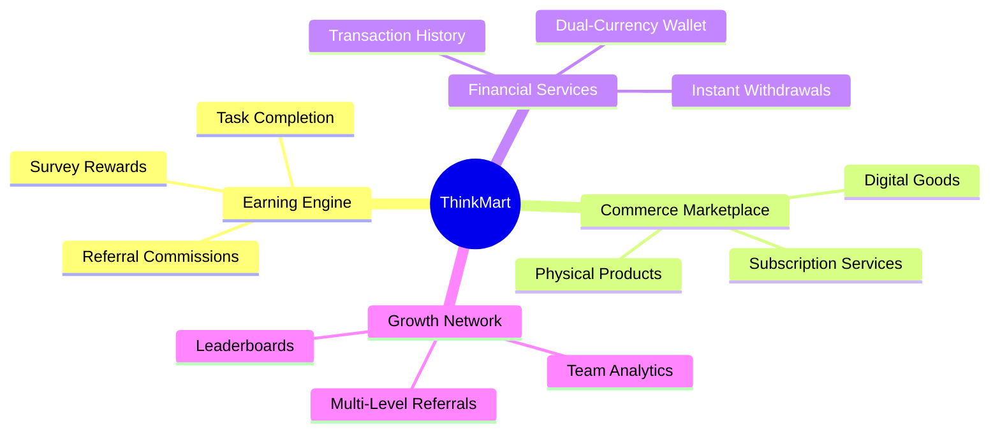

### The Thesis

> **We monetize attention and amplify it through network effects.**

Every user who completes a task generates value. Every referral compounds that value. Every purchase recirculates earnings into the ecosystem.

### Business Model

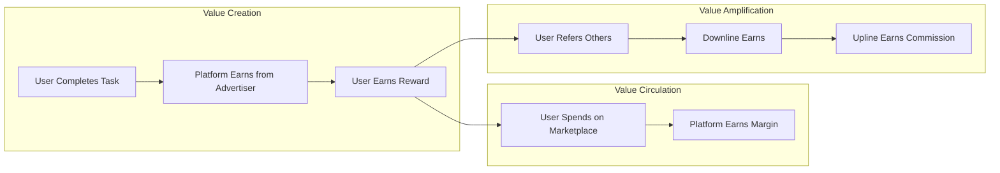

### Scale Indicators

| Metric | Current | Target (12 months) |
|:-------|:--------|:-------------------|
| **Monthly Active Users** | 50,000 | 500,000 |
| **Daily Transactions** | 25,000 | 250,000 |
| **Gross Merchandise Value** | $100K/month | $2M/month |
| **Payout Volume** | $50K/month | $1M/month |

---

## System Philosophy

### Core Principles

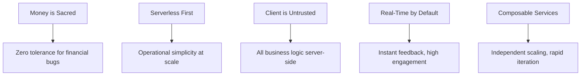

### Architectural Tenets

| Tenet | Implementation |
|:------|:---------------|
| **Immutability for Audit** | Transaction records never deleted; only append |
| **Idempotency Everywhere** | Every financial operation has a unique key |
| **Defense in Depth** | Security at Edge, Rules, and Application layers |
| **Optimistic UI** | Show success immediately; rollback if backend fails |
| **Event-Driven Side Effects** | Core actions trigger events; listeners handle consequences |

### Technology Stack

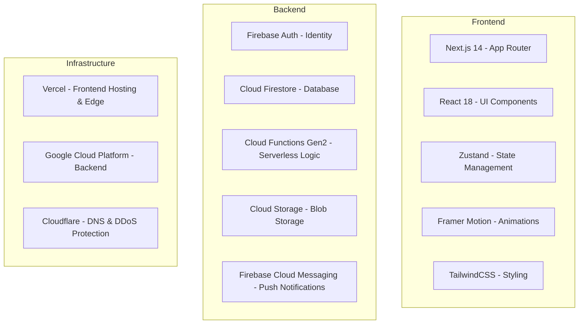

---

## Platform Capabilities Matrix

| Capability | Module | Status | Complexity |
|:-----------|:-------|:-------|:-----------|
| **User Registration** | Identity | ✅ Live | Low |
| **Email/Password Auth** | Identity | ✅ Live | Low |
| **Social OAuth** | Identity | ✅ Live | Low |
| **Role-Based Access Control** | Identity | ✅ Live | Medium |
| **Referral Code System** | MLM Engine | ✅ Live | Medium |
| **Multi-Level Commissions** | MLM Engine | ✅ Live | High |
| **Team Hierarchy Visualization** | MLM Engine | ✅ Live | Medium |
| **Dual-Currency Wallet** | Fintech | ✅ Live | High |
| **Transaction Ledger** | Fintech | ✅ Live | High |
| **Withdrawal Processing** | Fintech | ✅ Live | High |
| **Product Catalog** | Commerce | ✅ Live | Medium |
| **Shopping Cart** | Commerce | ✅ Live | Low |
| **Order Management** | Commerce | ✅ Live | Medium |
| **Task Engine** | Engagement | ✅ Live | Medium |
| **Survey System** | Engagement | ✅ Live | Medium |
| **Push Notifications** | Engagement | ✅ Live | Low |
| **Admin Dashboard** | Operations | ✅ Live | Medium |

---

## Service Architecture Overview

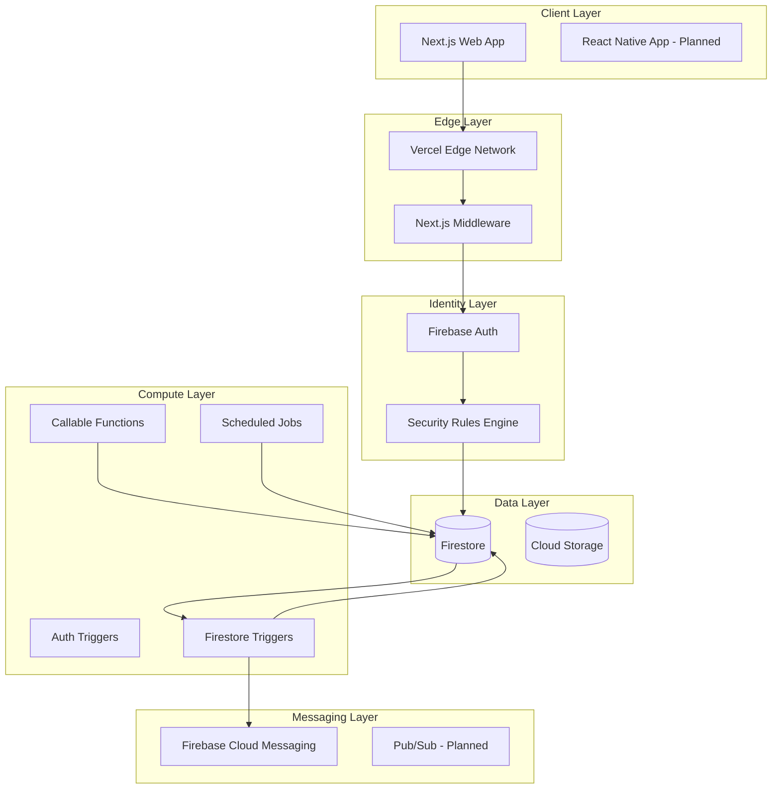

### Service Boundaries

| Service | Responsibilities | Data Owned |
|:--------|:-----------------|:-----------|
| **Identity Service** | Auth, Session, RBAC | `users/*` |
| **Ledger Service** | Wallet, Transactions | `wallets/*`, `transactions/*` |
| **Graph Service** | Referrals, Teams, Commissions | `teams/*`, ancestry logic |
| **Commerce Service** | Products, Orders, Inventory | `products/*`, `orders/*` |
| **Engagement Service** | Tasks, Surveys, Notifications | `tasks/*`, `surveys/*` |
| **Admin Service** | Dashboard, Moderation, Analytics | `audit_logs/*` |

---

## Data Flow Overview

### Primary User Journeys

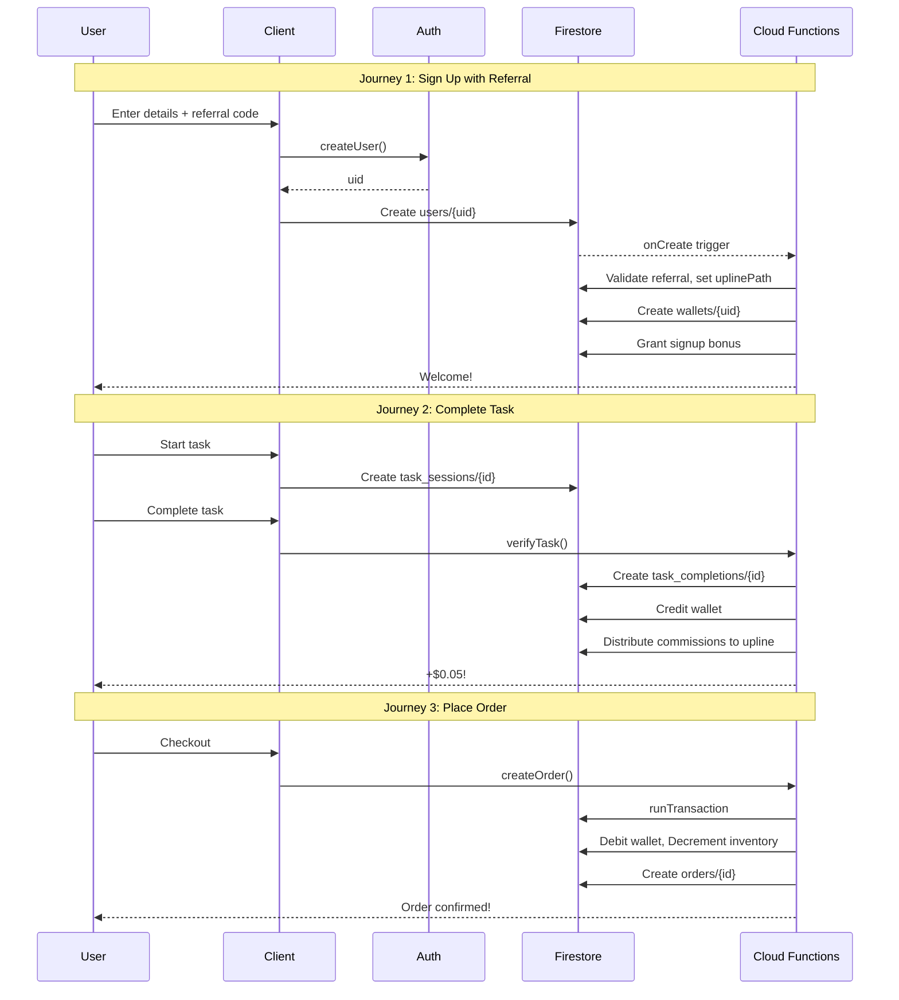

### Event Propagation

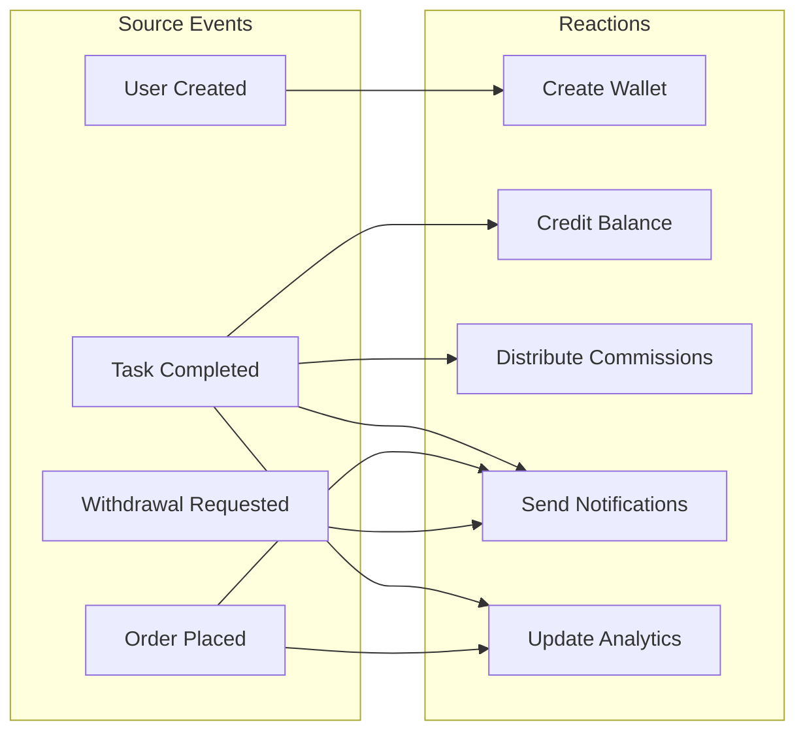

---

## Reliability Strategy

### Failure Domains

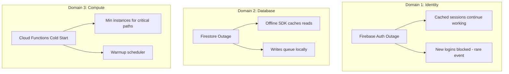

### Recovery Patterns

| Failure Mode | Detection | Recovery | RTO |
|:-------------|:----------|:---------|:----|
| **Auth Outage** | Error rate spike | Wait for Google recovery | <1 hour |
| **Firestore Outage** | SDK throws UNAVAILABLE | Retry with backoff | <30 min |
| **Function Failure** | Error logs | Retry with DLQ | <5 min |
| **Data Corruption** | Reconciliation job | Point-in-time restore | <4 hours |

### SLO Targets

| Service | Metric | Target |
|:--------|:-------|:-------|
| **API Availability** | Uptime | 99.9% |
| **Transaction Latency** | P95 | < 500ms |
| **Notification Delivery** | Success Rate | 99.5% |
| **Withdrawal Processing** | Completion Time | < 24 hours |

---

## Operational Model

### Team Responsibilities

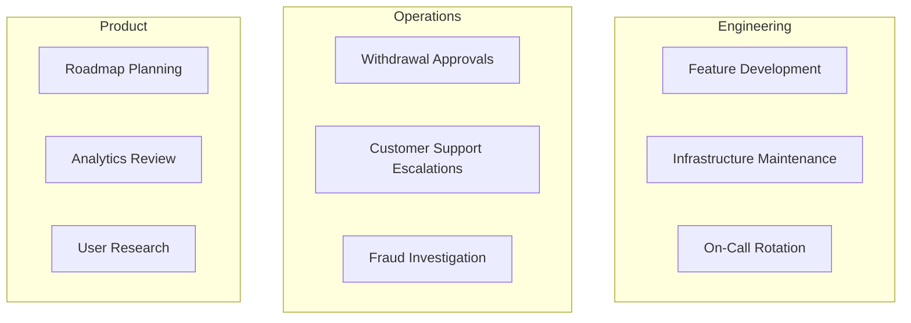

### Deployment Cadence

| Environment | Deploy Trigger | Validation |
|:------------|:---------------|:-----------|
| **Development** | Every commit | Automated tests |
| **Staging** | PR merge to `develop` | QA + Smoke tests |
| **Production** | Manual promotion | Staged rollout (5% → 100%) |

### Monitoring Dashboard

- **P0 Alerts**: Pager on wallet inconsistencies, >5% error rate
- **P1 Alerts**: Slack on elevated latency, queue backlog
- **Daily Reports**: GMV, DAU, Transaction volume
- **Weekly Reviews**: Cohort retention, Funnel conversion

---

## Key Performance Indicators

### Growth Metrics

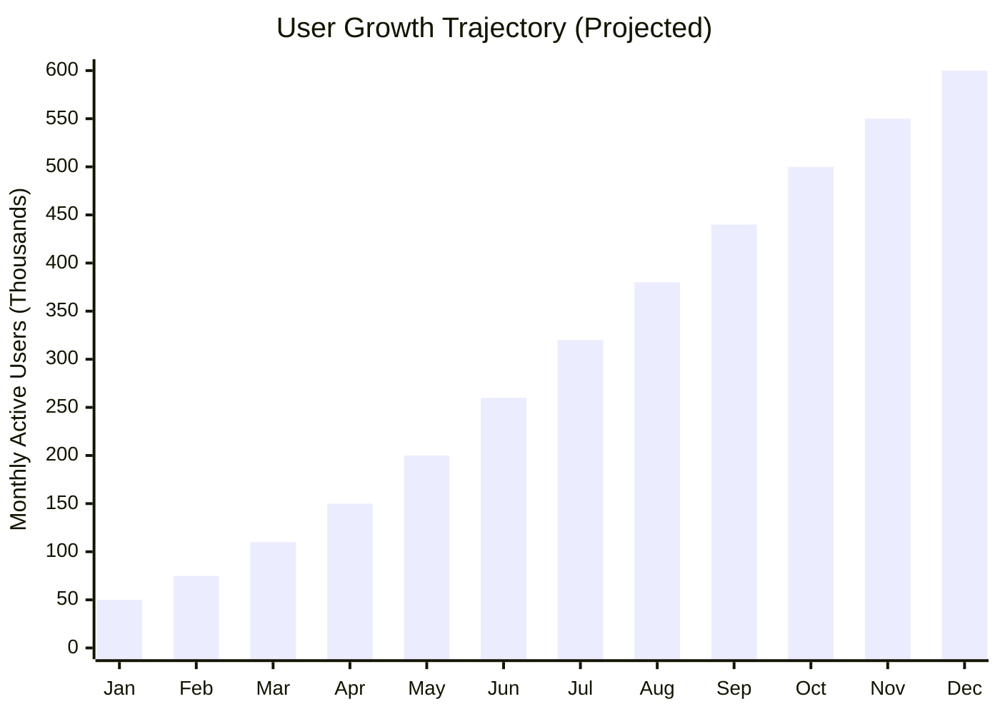

### Financial Health

| Metric | Formula | Target |
|:-------|:--------|:-------|
| **Take Rate** | Platform Revenue / GMV | 15-20% |
| **LTV:CAC** | Lifetime Value / Acquisition Cost | > 3:1 |
| **Payout Ratio** | Total Payouts / Task Revenue | < 70% |

### Engagement Health

| Metric | Description | Target |
|:-------|:------------|:-------|
| **D1 Retention** | % return next day | > 60% |
| **D7 Retention** | % return within week | > 40% |
| **D30 Retention** | % return within month | > 25% |
| **Referral Rate** | % users who refer | > 15% |

---

## Competitive Advantages

### Moat Analysis

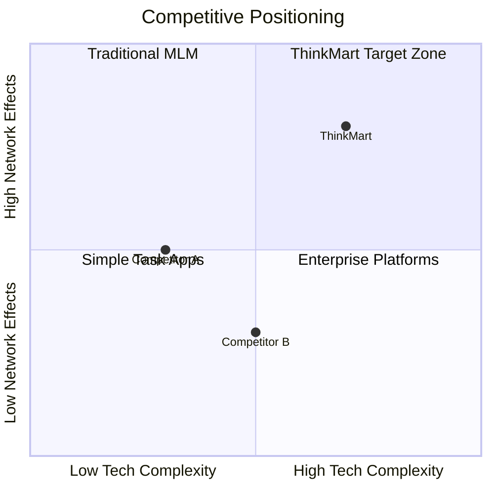

### Defensibility

| Moat Type | ThinkMart Advantage |
|:----------|:--------------------|
| **Network Effects** | Every user makes the platform more valuable for others through referrals |
| **Data Advantage** | Proprietary graph of earning relationships and behavior |
| **Switching Costs** | Accumulated balance, team, and reputation |
| **Operational Excellence** | Real-time, transparent, instant payouts |

---

*This document serves as the authoritative overview of ThinkMart's platform. Updated quarterly by Engineering Leadership.*
