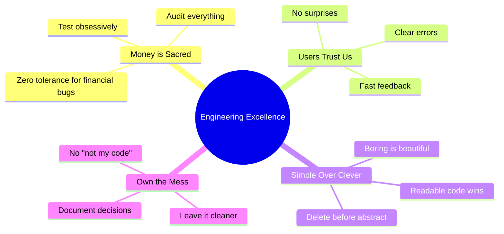
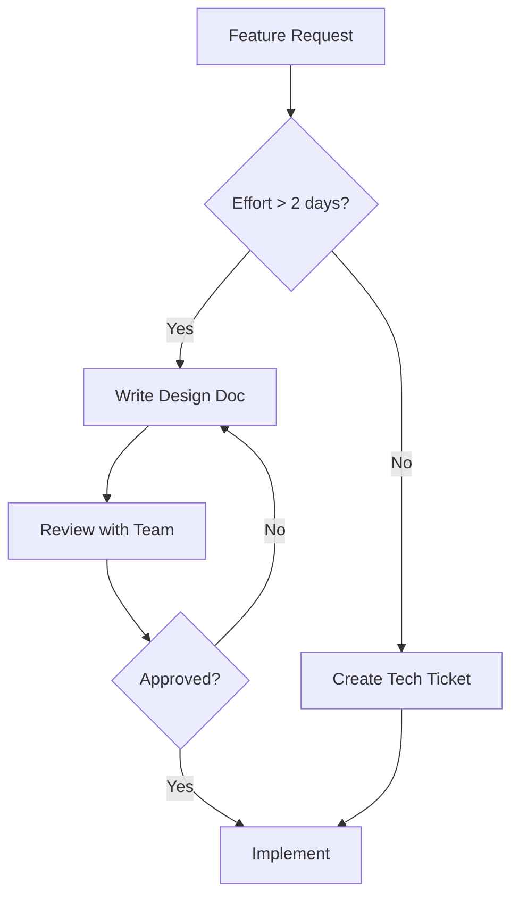
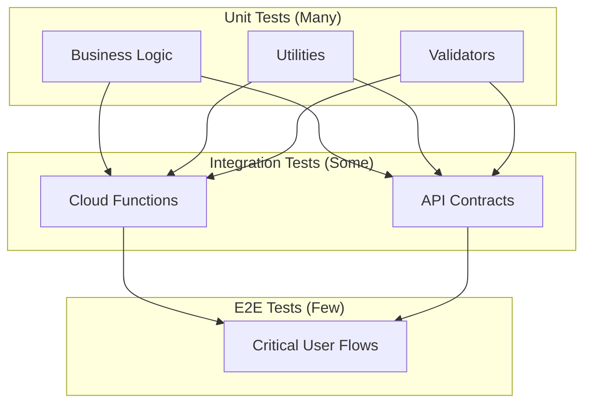
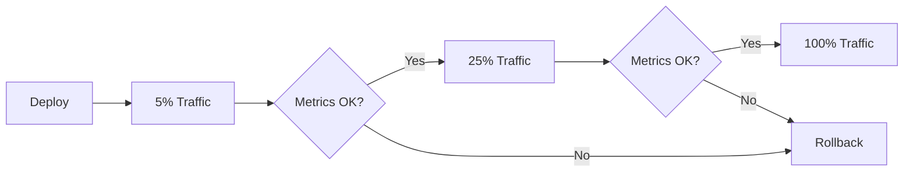
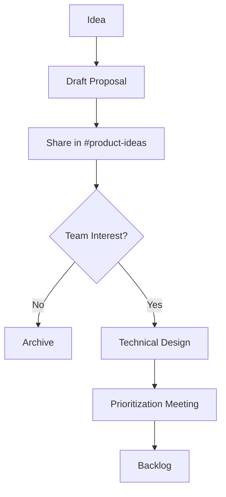
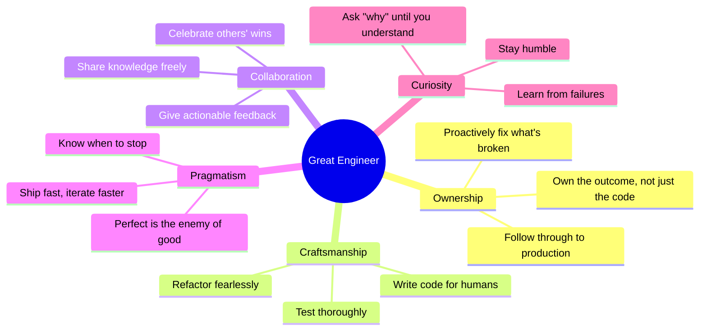

# Engineering Guidelines

> **Document Version**: 2.0  
> **Last Updated**: January 2026  
> **Audience**: All Engineers

---

## Table of Contents
1. [Engineering Principles](#engineering-principles)
2. [Code Quality Standards](#code-quality-standards)
3. [System Design Expectations](#system-design-expectations)
4. [Testing Philosophy](#testing-philosophy)
5. [Deployment Safety](#deployment-safety)
6. [Observability Requirements](#observability-requirements)
7. [New Engineer Onboarding](#new-engineer-onboarding)
8. [How to Propose Features](#how-to-propose-features)
9. [How to Avoid Architectural Decay](#how-to-avoid-architectural-decay)
10. [Characteristics of a Great Engineer](#characteristics-of-a-great-engineer-on-this-project)

---

## Engineering Principles

### The ThinkMart Engineering Creed



### Principle Details

| Principle | Meaning | Example |
|:----------|:--------|:--------|
| **Money is Sacred** | We do not ship financial code without exhaustive testing. A bug that loses $0.01 is as serious as one that loses $10,000. | Always use Firestore transactions for wallet mutations. |
| **Fail Loudly** | Silent failures are worse than crashes. If something goes wrong, make it obvious. | Throw errors; don't return `null` quietly. |
| **Optimize for Deletion** | Code that's easy to delete is easy to maintain. Small, focused modules. | Avoid "god classes" that do everything. |
| **No Magic** | Explicit is better than implicit. Avoid clever hacks that require tribal knowledge. | Prefer copy-paste over a wrong abstraction. |
| **Document Why, Not What** | Code shows what; comments explain why. | `// We use a 24h hold because of chargeback fraud patterns` |

---

## Code Quality Standards

### TypeScript Standards

```typescript
// ✅ GOOD: Explicit types, no `any`
interface TaskReward {
  amount: number;
  currency: 'CASH' | 'COIN';
}

function calculateReward(task: Task): TaskReward {
  return {
    amount: task.baseReward * getMultiplier(task.type),
    currency: task.rewardCurrency,
  };
}

// ❌ BAD: Using `any`, no return type
function calculateReward(task: any) {
  return {
    amount: task.baseReward * getMultiplier(task.type),
    currency: task.rewardCurrency,
  };
}
```

### Code Style Rules

| Rule | Enforcement | Tool |
|:-----|:------------|:-----|
| **No `any`** | Error | TypeScript `strict` |
| **No unused variables** | Error | ESLint |
| **No console.log in production** | Error | ESLint |
| **Max function length: 50 lines** | Warning | ESLint |
| **Max file length: 300 lines** | Warning | ESLint |
| **Consistent formatting** | Auto-fix | Prettier |

### Naming Conventions

| Type | Convention | Example |
|:-----|:-----------|:--------|
| **Variables** | camelCase | `userId`, `taskCount` |
| **Constants** | SCREAMING_SNAKE | `MAX_RETRY_COUNT` |
| **Functions** | camelCase, verb prefix | `calculateReward()`, `fetchUser()` |
| **Types/Interfaces** | PascalCase | `UserProfile`, `TaskReward` |
| **Files** | kebab-case | `user-service.ts`, `wallet.utils.ts` |
| **React Components** | PascalCase | `WalletCard.tsx`, `TaskList.tsx` |

### Folder Structure

```
/app
  /(public)        # Public pages (no auth required)
  /auth            # Auth pages (login, register)
  /dashboard       # Protected pages
    /[feature]/    # Feature-specific pages
/components
  /ui              # Reusable UI primitives
  /features        # Feature-specific components
/lib
  /firebase.ts     # Firebase initialization
  /utils.ts        # Pure utility functions
/services          # API service wrappers
/hooks             # Custom React hooks
/types             # TypeScript type definitions
/functions
  /src
    /auth          # Auth-related functions
    /wallet        # Wallet functions
    /orders        # Order functions
    /index.ts      # Export all functions
```

---

## System Design Expectations

### Before You Code



### Design Doc Template

```markdown
# RFC: [Feature Name]

## Problem Statement
What problem are we solving? Who is affected?

## Proposed Solution
High-level approach. Include diagrams if helpful.

## Alternatives Considered
What else did we consider? Why not?

## Data Model Changes
New collections? Schema changes?

## API Changes
New endpoints? Breaking changes?

## Security Considerations
Auth? Authorization? Data exposure?

## Rollout Plan
Feature flag? Gradual rollout?

## Open Questions
What needs more discussion?
```

### Design Checklist

- [ ] What happens if the database is down?
- [ ] What happens if this function times out?
- [ ] What happens if a user hits this endpoint 1000x/second?
- [ ] What data needs to be indexed for this query?
- [ ] Is this operation idempotent?
- [ ] What's the rollback plan if this breaks in production?

---

## Testing Philosophy

### Test Pyramid



### Testing Requirements

| Layer | Coverage Target | Tools |
|:------|:----------------|:------|
| **Unit Tests** | 80% for `/lib`, `/services` | Vitest |
| **Integration Tests** | All Cloud Functions | firebase-functions-test |
| **E2E Tests** | Critical paths (signup, checkout) | Playwright |

### What to Test

```typescript
// ✅ GOOD: Test business logic
describe('calculateCommission', () => {
  it('returns 10% for level 1 referrals', () => {
    expect(calculateCommission(100, 1)).toBe(10);
  });
  
  it('returns 5% for level 2 referrals', () => {
    expect(calculateCommission(100, 2)).toBe(5);
  });
  
  it('returns 0 for levels beyond max', () => {
    expect(calculateCommission(100, 10)).toBe(0);
  });
  
  it('handles zero amount', () => {
    expect(calculateCommission(0, 1)).toBe(0);
  });
});

// ❌ BAD: Testing implementation details
describe('UserCard', () => {
  it('has a div with class "user-card"', () => {
    // Don't test CSS class names
  });
});
```

### Golden Rule

> **Test behavior, not implementation. If you refactor and tests break, but behavior is unchanged, your tests are wrong.**

---

## Deployment Safety

### Deployment Checklist

- [ ] All tests pass locally
- [ ] PR reviewed and approved
- [ ] No high-severity lint errors
- [ ] Database changes are backward compatible
- [ ] Feature flag in place for risky changes
- [ ] Rollback plan documented
- [ ] Monitoring dashboard checked

### Progressive Rollout



### Rollback Procedure

1. **Identify**: Alert triggers or user report
2. **Confirm**: Check error rates, latency
3. **Rollback**: `vercel rollback` or `firebase functions:delete`
4. **Communicate**: Notify team in #engineering
5. **Post-mortem**: Schedule within 24 hours

---

## Observability Requirements

### Structured Logging

```typescript
// ✅ GOOD: Structured, searchable
functions.logger.info('Order created', {
  orderId: order.id,
  userId: order.userId,
  total: order.total,
  itemCount: order.items.length,
});

// ❌ BAD: Unstructured
console.log('Order created: ' + order.id);
```

### Log Levels

| Level | When to Use | Example |
|:------|:------------|:--------|
| **DEBUG** | Development only, verbose | Variable values |
| **INFO** | Normal operations | Order created, User logged in |
| **WARN** | Recoverable issues | Retry succeeded, Slow query |
| **ERROR** | Failures requiring attention | Transaction failed, API error |

### Metrics to Track

| Metric | Purpose | Alert Threshold |
|:-------|:--------|:----------------|
| **Error Rate** | Health | > 5% |
| **P95 Latency** | Performance | > 1000ms |
| **Function Invocations** | Scale | > 10x baseline |
| **Wallet Transactions** | Business | Anomaly detection |

### Trace IDs

Every request should carry a trace ID for correlation:

```typescript
const traceId = context.rawRequest?.headers['x-cloud-trace-context'] || uuid();
functions.logger.info('Processing request', { traceId, action: 'createOrder' });
```

---

## New Engineer Onboarding

### Week 1: Foundations

| Day | Goal | Deliverable |
|:----|:-----|:------------|
| **Day 1** | Environment setup | Run app locally + emulators |
| **Day 2** | Architecture overview | Read all docs in this folder |
| **Day 3** | Codebase tour | Pair with mentor on a small fix |
| **Day 4** | First PR | Trivial change (typo, log message) |
| **Day 5** | Feature walkthrough | Shadow a feature from design to deploy |

### Week 2: First Feature

| Day | Goal | Deliverable |
|:----|:-----|:------------|
| **Day 6-7** | Pick starter ticket | Claim from "Good First Issues" |
| **Day 8-9** | Implement | Code + tests |
| **Day 10** | Ship to staging | Deploy and verify |

### Week 3-4: Independence

| Goal | Deliverable |
|:-----|:------------|
| Pick a medium ticket | Implement end-to-end |
| Lead a design review | Present your approach |
| Review a teammate's PR | Provide substantive feedback |

### Onboarding Buddies

Every new engineer is paired with a buddy who:
- Answers quick questions
- Reviews first PRs
- Provides context on historical decisions

---

## How to Propose Features

### Feature Proposal Template

```markdown
# Feature Proposal: [Name]

## One-Liner
Explain the feature in one sentence.

## User Problem
What pain point does this solve? For whom?

## Proposed Solution
How do we solve it? (High-level)

## Success Metrics
How do we know it worked?

## Scope
- In scope: ...
- Out of scope: ...

## Open Questions
What needs discussion?
```

### Proposal Flow



---

## How to Avoid Architectural Decay

### Code Hygiene Habits

| Practice | Frequency | Owner |
|:---------|:----------|:------|
| **Dependency Audit** | Monthly | On-call engineer |
| **Dead Code Removal** | Per PR | PR author |
| **Index Review** | Quarterly | Data engineer |
| **Security Rules Review** | Quarterly | Security champion |
| **Documentation Update** | Per feature | Feature owner |

### The Boy Scout Rule

> **Leave the campground cleaner than you found it.**

Every PR should include at least one small improvement:
- Fix a typo in comments
- Remove an unused import
- Add a missing type annotation
- Improve an error message

### Tech Debt Budget

We allocate **20% of engineering time** to tech debt:
- 1 day per week for each engineer
- Tracked in "Tech Debt" Jira label
- Reviewed in sprint retrospectives

---

## Characteristics of a Great Engineer on This Project

### The ThinkMart Engineer



### Behaviors We Value

| Behavior | Example |
|:---------|:--------|
| **Take initiative** | "I noticed X was breaking, so I fixed it" |
| **Communicate proactively** | "I'm blocked on Y; here's what I've tried" |
| **Write for the future reader** | Clear variable names, helpful comments |
| **Disagree and commit** | Voice concerns, then support the decision |
| **Celebrate learning** | "I was wrong about X; here's what I learned" |

### Anti-Patterns to Avoid

| Anti-Pattern | Why It's Harmful | Alternative |
|:-------------|:-----------------|:------------|
| **"That's not my code"** | Diffuses ownership | "I'll look into it" |
| **Shipping without tests** | Technical debt forever | Write tests first |
| **Heroics** | Unsustainable, hides systemic issues | Build sustainable processes |
| **Bikeshedding** | Wastes time on trivia | Focus on impact |
| **Siloed knowledge** | Bus factor of 1 | Document and pair |

---

### Final Words

> **The best engineers make everyone around them better.**

This isn't just about writing code. It's about:
- **Making good decisions** that stand the test of time
- **Building trust** through reliability and transparency
- **Creating leverage** by building systems that multiply our efforts
- **Leaving a legacy** of code that others are proud to work in

Welcome to the team. Let's build something great together.

---

*These guidelines are living documents. Propose changes via PR to the docs folder.*
