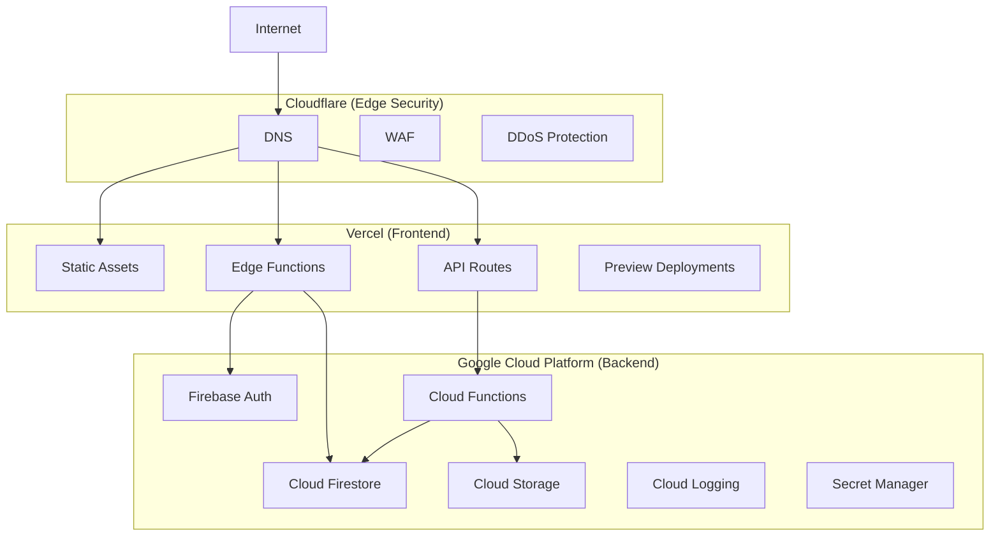
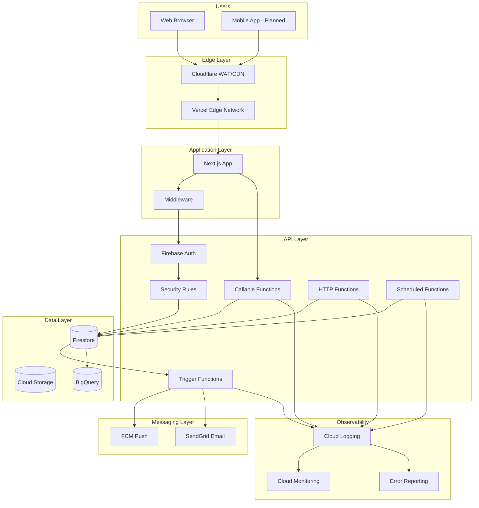
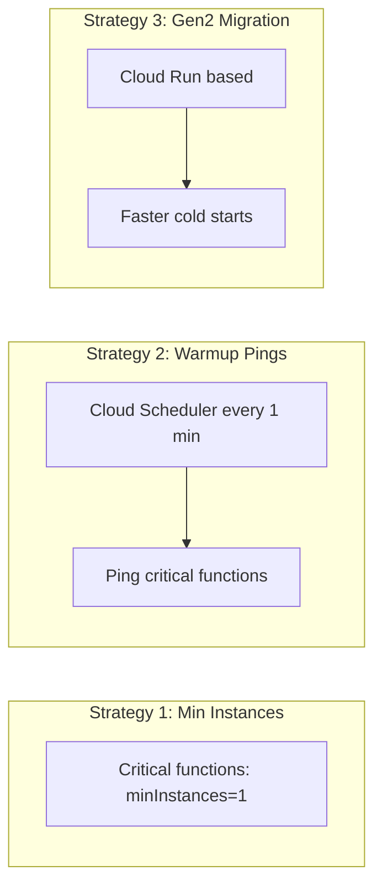
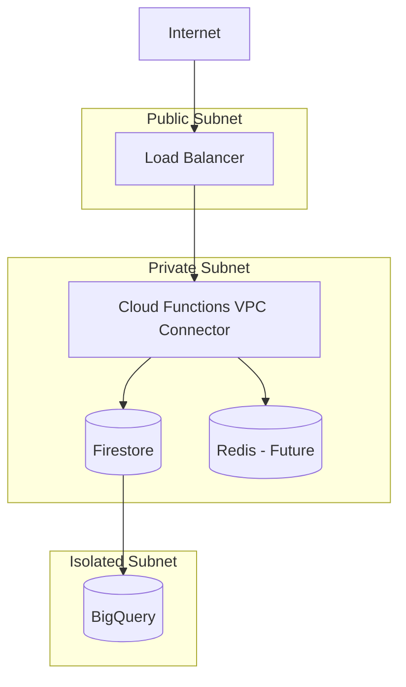
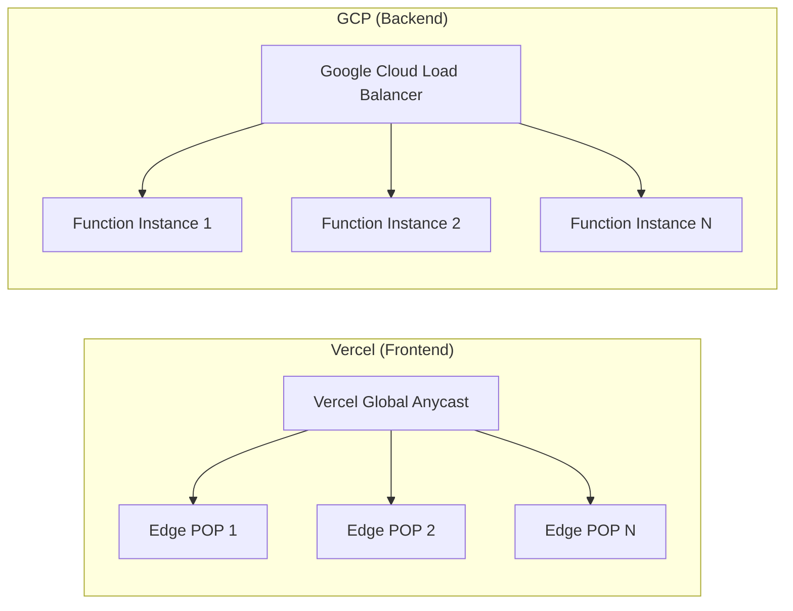
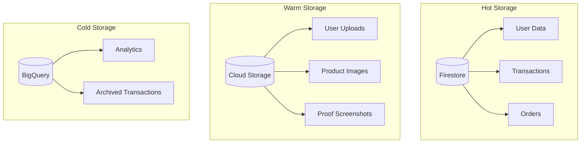
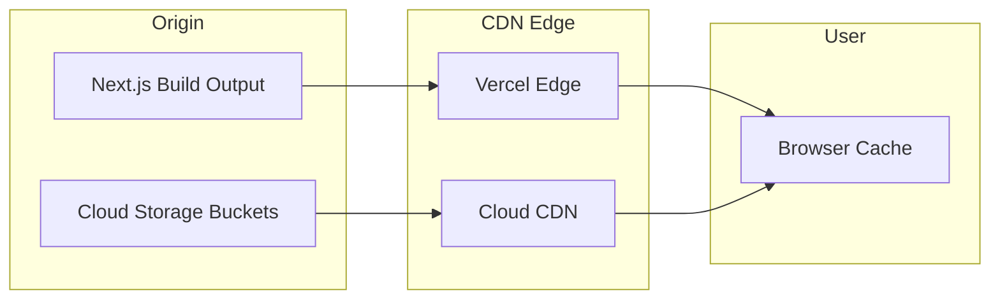
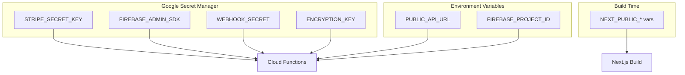
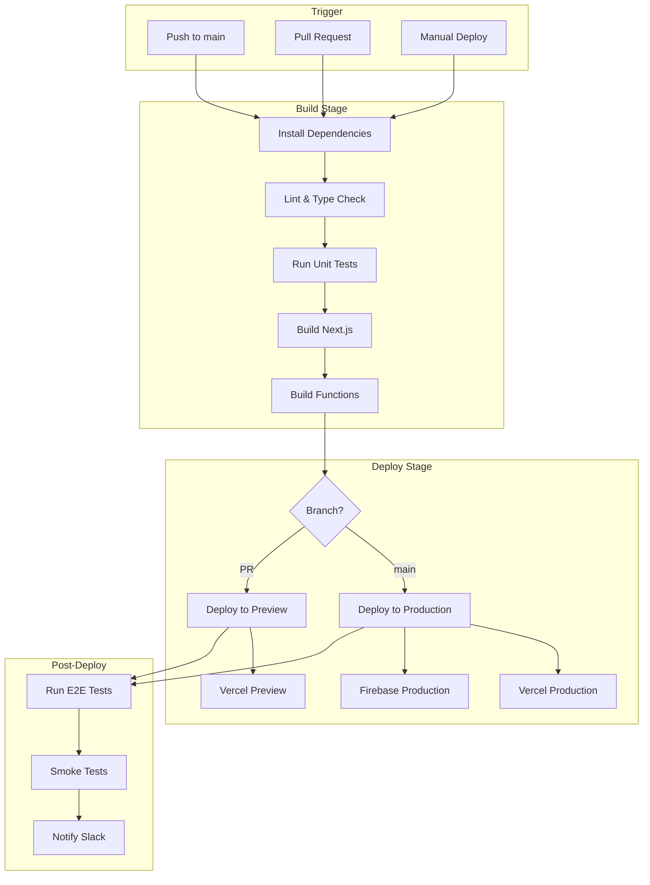
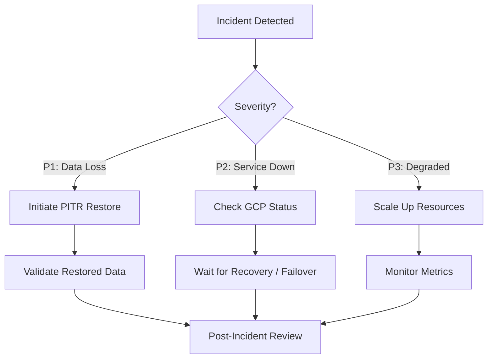

# Infrastructure Design

> **Document Version**: 2.0  
> **Last Updated**: January 2026  
> **Audience**: DevOps, Platform Engineers, SREs

---

## Table of Contents
1. [Cloud Strategy](#cloud-strategy)
2. [Infrastructure Diagram](#infrastructure-diagram)
3. [Compute Layer](#compute-layer)
4. [Networking Model](#networking-model)
5. [Load Balancing](#load-balancing)
6. [Auto Scaling](#auto-scaling)
7. [Storage Systems](#storage-systems)
8. [CDN Strategy](#cdn-strategy)
9. [Secrets Management](#secrets-management)
10. [CI/CD Pipeline](#cicd-pipeline)
11. [Environment Strategy](#environment-strategy)
12. [Cost Awareness Strategy](#cost-awareness-strategy)
13. [Disaster Recovery](#disaster-recovery)

---

## Cloud Strategy

### Multi-Cloud Architecture



### Platform Selection Rationale

| Component | Platform | Why |
|:----------|:---------|:----|
| **Frontend Hosting** | Vercel | Best-in-class Next.js support, global edge network |
| **Authentication** | Firebase Auth | Native Firestore integration, managed security |
| **Database** | Cloud Firestore | Real-time sync, serverless, auto-scaling |
| **Serverless Compute** | Cloud Functions | Firebase triggers, pay-per-use |
| **Blob Storage** | Cloud Storage | Cheap, reliable, CDN-ready |
| **DNS & Security** | Cloudflare | DDoS protection, global anycast |

---

## Infrastructure Diagram



---

## Compute Layer

### Cloud Functions Configuration

| Function | Runtime | Memory | Timeout | Min Instances | Max Instances |
|:---------|:--------|:-------|:--------|:--------------|:--------------|
| `createOrder` | Node.js 18 | 512 MB | 60s | 1 | 100 |
| `requestWithdrawal` | Node.js 18 | 256 MB | 30s | 1 | 50 |
| `verifyTask` | Node.js 18 | 256 MB | 30s | 1 | 200 |
| `calculateCommission` | Node.js 18 | 512 MB | 120s | 1 | 100 |
| `processScheduledJobs` | Node.js 18 | 1 GB | 540s | 0 | 10 |
| `userOnCreate` | Node.js 18 | 256 MB | 30s | 0 | 100 |

### Cold Start Mitigation



---

## Networking Model

### VPC Configuration (Future)



### Firewall Rules

| Rule | Source | Destination | Port | Action |
|:-----|:-------|:------------|:-----|:-------|
| Allow HTTPS | 0.0.0.0/0 | Load Balancer | 443 | Allow |
| Allow Functions | VPC Connector | Firestore | 443 | Allow |
| Deny All | * | * | * | Deny |

---

## Load Balancing

### Current Architecture



### Load Balancing Strategy

| Traffic Type | Handler | Algorithm |
|:-------------|:--------|:----------|
| **Static Assets** | Vercel CDN | Geolocation |
| **API Routes** | Vercel Edge | Geolocation |
| **Callable Functions** | GCP LB | Round-robin |
| **Webhooks** | GCP LB | Round-robin |

---

## Auto Scaling

### Scaling Configuration

```yaml
# Cloud Functions scaling (conceptual)
scaling:
  createOrder:
    minInstances: 1
    maxInstances: 100
    targetConcurrency: 80  # Scale up at 80% utilization
    
  verifyTask:
    minInstances: 1
    maxInstances: 200
    targetConcurrency: 60  # More aggressive for time-sensitive
    
  processScheduledJobs:
    minInstances: 0
    maxInstances: 10
    targetConcurrency: 1  # One job per instance
```

### Scaling Triggers

| Metric | Threshold | Action |
|:-------|:----------|:-------|
| CPU Utilization | > 70% | Scale up |
| Request Count | > 1000/min | Scale up |
| Error Rate | > 5% | Alert + Hold |
| Cold Start Ratio | > 20% | Increase min instances |

---

## Storage Systems

### Storage Tiers



### Storage Configuration

| Storage | Type | Region | Redundancy | Cost |
|:--------|:-----|:-------|:-----------|:-----|
| **Firestore** | Multi-region | nam5 | 99.999% SLA | $0.18/100K reads |
| **Cloud Storage** | Regional | us-central1 | 99.99% SLA | $0.02/GB/month |
| **BigQuery** | Multi-region | US | 99.99% SLA | $5/TB queried |

---

## CDN Strategy

### Asset Caching



### Cache Policy

| Asset Type | TTL | Cache-Control | Invalidation |
|:-----------|:----|:--------------|:-------------|
| **Static JS/CSS** | 1 year | `immutable` | Filename hash |
| **Images** | 7 days | `max-age=604800` | Cache-bust param |
| **HTML** | 0 | `no-cache` | On deploy |
| **API Responses** | 0 | `no-store` | N/A |

---

## Secrets Management

### Secret Hierarchy



### Secret Access Policy

| Secret | Access | Rotation |
|:-------|:-------|:---------|
| `STRIPE_SECRET_KEY` | Functions only | 90 days |
| `FIREBASE_ADMIN_SDK` | Functions only | Never (service account) |
| `WEBHOOK_SECRET` | Functions only | On compromise |
| `ENCRYPTION_KEY` | Functions only | Annual |

---

## CI/CD Pipeline

### Pipeline Architecture



### GitHub Actions Workflow

```yaml
name: Deploy
on:
  push:
    branches: [main]
  pull_request:
    branches: [main]

jobs:
  build:
    runs-on: ubuntu-latest
    steps:
      - uses: actions/checkout@v4
      - uses: actions/setup-node@v4
        with:
          node-version: '18'
          cache: 'npm'
      
      - run: npm ci
      - run: npm run lint
      - run: npm run type-check
      - run: npm test
      - run: npm run build

  deploy-preview:
    needs: build
    if: github.event_name == 'pull_request'
    runs-on: ubuntu-latest
    steps:
      - uses: amondnet/vercel-action@v25
        with:
          vercel-token: ${{ secrets.VERCEL_TOKEN }}
          vercel-org-id: ${{ secrets.VERCEL_ORG_ID }}
          vercel-project-id: ${{ secrets.VERCEL_PROJECT_ID }}

  deploy-production:
    needs: build
    if: github.ref == 'refs/heads/main'
    runs-on: ubuntu-latest
    steps:
      - uses: amondnet/vercel-action@v25
        with:
          vercel-token: ${{ secrets.VERCEL_TOKEN }}
          vercel-args: '--prod'
      
      - uses: w9jds/firebase-action@master
        with:
          args: deploy --only functions,firestore:rules
        env:
          FIREBASE_TOKEN: ${{ secrets.FIREBASE_TOKEN }}
```

---

## Environment Strategy

### Environment Matrix

| Environment | URL | Database | Purpose |
|:------------|:----|:---------|:--------|
| **Local** | localhost:3000 | Firebase Emulators | Development |
| **Preview** | *.vercel.app | thinkmart-staging | PR Review |
| **Staging** | staging.thinkmart.com | thinkmart-staging | QA/UAT |
| **Production** | thinkmart.com | thinkmart-prod | Live Users |

### Environment Variables

| Variable | Local | Preview | Staging | Production |
|:---------|:------|:--------|:--------|:-----------|
| `FIREBASE_PROJECT` | emulator | staging | staging | prod |
| `API_URL` | localhost | preview | staging | prod |
| `DEBUG` | true | true | true | false |
| `SENTRY_DSN` | - | staging | staging | prod |

---

## Cost Awareness Strategy

### Monthly Cost Breakdown (Projected at 100K MAU)

| Service | Estimated Cost | Optimization |
|:--------|:---------------|:-------------|
| **Firestore** | $500 | Pagination, caching |
| **Cloud Functions** | $200 | Min instances, efficient code |
| **Cloud Storage** | $50 | Lifecycle policies |
| **Vercel** | $20 (Pro) | - |
| **Cloudflare** | $0 (Free) | - |
| **Total** | ~$770/month | |

### Cost Alerts

| Threshold | Action |
|:----------|:-------|
| 80% of budget | Email alert |
| 100% of budget | Slack + PagerDuty |
| 150% of budget | Auto-disable non-critical |

---

## Disaster Recovery

### Backup Strategy

| Data | Backup Frequency | Retention | Recovery Time |
|:-----|:-----------------|:----------|:--------------|
| **Firestore** | Daily (PITR) | 7 days | < 1 hour |
| **Cloud Storage** | No backup (CDN source) | - | - |
| **Secrets** | Manual export | As needed | < 15 min |

### Recovery Procedures



---

*This infrastructure document defines the production environment. All changes require change request approval.*
