# Scaling Strategy

> **Document Version**: 2.0  
> **Last Updated**: January 2026  
> **Audience**: Platform Engineers, SREs, Technical Leadership

---

## Table of Contents
1. [Bottleneck Forecasting](#bottleneck-forecasting)
2. [Horizontal Scaling Plan](#horizontal-scaling-plan)
3. [Read vs Write Scaling](#read-vs-write-scaling)
4. [Queue-Based Architectures](#queue-based-architectures)
5. [Event-Driven Evolution](#event-driven-evolution)
6. [SLOs / SLAs](#slos--slas)
7. [Capacity Planning](#capacity-planning)
8. [Traffic Surge Handling](#traffic-surge-handling)
9. [Scaling Activation Triggers](#scaling-activation-triggers)

---

## Bottleneck Forecasting

### System Bottleneck Map

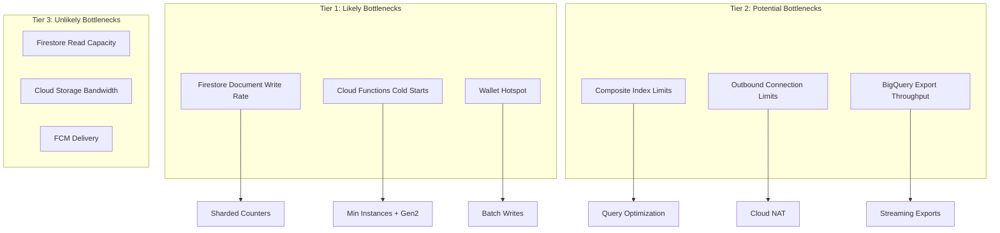

### Bottleneck Thresholds

| Resource | Soft Limit | Hard Limit | Current Usage | Risk Level |
|:---------|:-----------|:-----------|:--------------|:-----------|
| **Document Write Rate** | 1/sec | 10/sec (burst) | 0.1/sec | 🟢 Low |
| **Cold Start Latency** | 500ms | 2000ms | 800ms avg | 🟡 Medium |
| **Concurrent Function Instances** | 3,000 | 3,000 | 50 | 🟢 Low |
| **Firestore Index Count** | 200 | 200 | 45 | 🟢 Low |
| **Daily Firestore Reads** | 50M | Unlimited | 1M | 🟢 Low |

---

## Horizontal Scaling Plan

### Scaling Dimensions

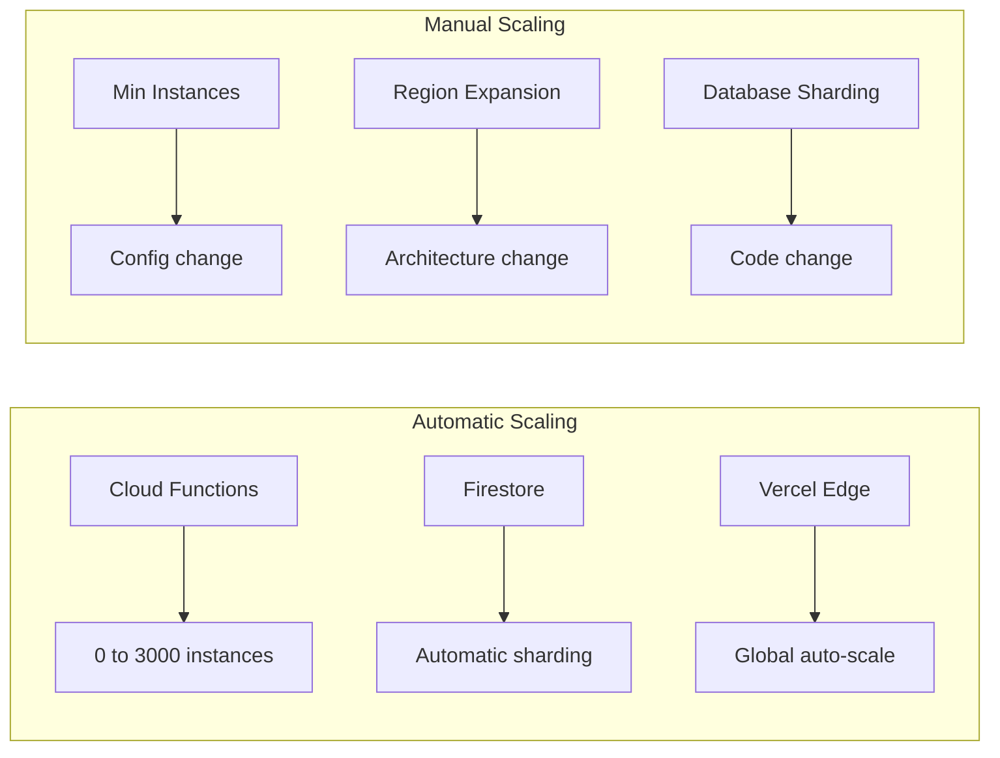

### Scaling by Component

| Component | Scaling Type | Trigger | Action |
|:----------|:-------------|:--------|:-------|
| **Cloud Functions** | Automatic | Request volume | Add instances |
| **Firestore** | Automatic | Data volume | Split tablets |
| **CDN Edge** | Automatic | Traffic | Add POPs |
| **BigQuery** | Automatic | Query load | Add slots |

---

## Read vs Write Scaling

### Read Scaling Strategy

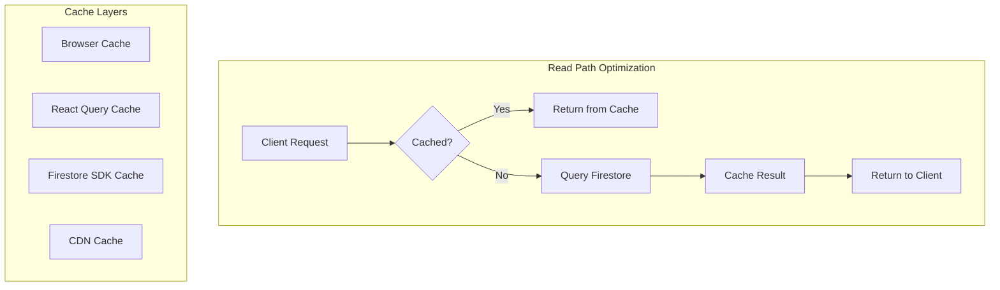

### Write Scaling Strategy

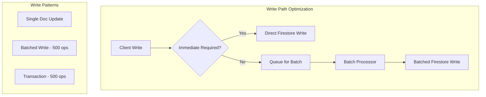

### Read/Write Ratio Analysis

| Operation | Read:Write Ratio | Optimization |
|:----------|:-----------------|:-------------|
| **Product Browsing** | 1000:1 | Aggressive caching |
| **Wallet Check** | 100:1 | Real-time listener |
| **Task Completion** | 1:3 | Write batching |
| **Order Placement** | 1:5 | Transaction optimization |

---

## Queue-Based Architectures

### Current Architecture

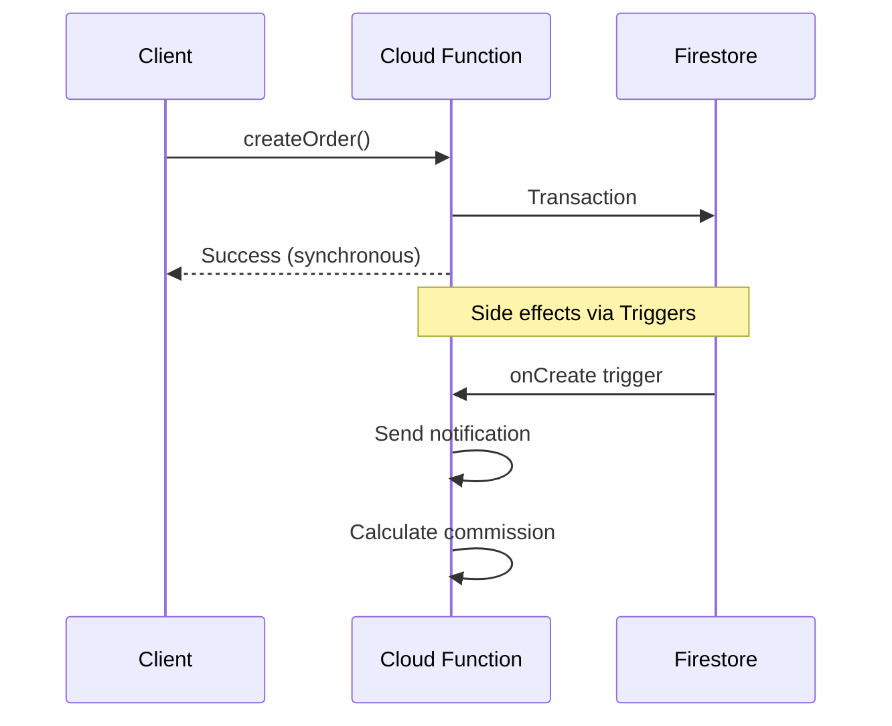

### Future: Queue-Based Architecture

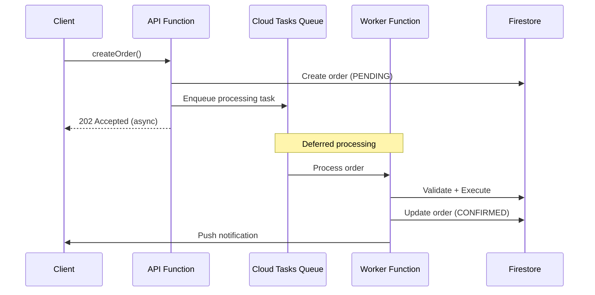

### Queue Configuration

| Queue | Rate Limit | Retry Policy | Use Case |
|:------|:-----------|:-------------|:---------|
| **order-processing** | 100/sec | 3 retries, exponential | Order fulfillment |
| **commission-distribution** | 500/sec | 5 retries, exponential | MLM payouts |
| **notification-delivery** | 1000/sec | 3 retries, linear | Push/Email |
| **export-jobs** | 10/sec | 1 retry | Analytics export |

---

## Event-Driven Evolution

### Evolution Path

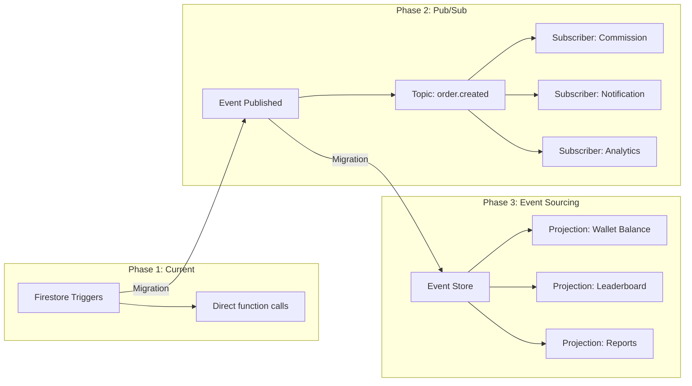

### Event Catalog (Proposed)

| Event | Trigger | Subscribers |
|:------|:--------|:------------|
| `user.created` | User signup | Wallet init, Welcome email, Referral bonus |
| `task.completed` | Task verification | Credit wallet, Commission calc, Notification |
| `order.created` | Order placement | Inventory update, Notification, Analytics |
| `order.shipped` | Admin action | Customer notification, Tracking |
| `withdrawal.approved` | Admin action | Payout processor, Notification |

---

## SLOs / SLAs

### Service Level Objectives

| Service | Metric | Target | Measurement |
|:--------|:-------|:-------|:------------|
| **API Availability** | Uptime | 99.9% | Synthetic monitoring |
| **Order Latency** | P95 | < 1000ms | Cloud Monitoring |
| **Task Verification** | P95 | < 500ms | Cloud Monitoring |
| **Notification Delivery** | Success Rate | 99.5% | FCM reports |
| **Withdrawal Processing** | Completion Time | < 24 hours | Manual tracking |

### Error Budget

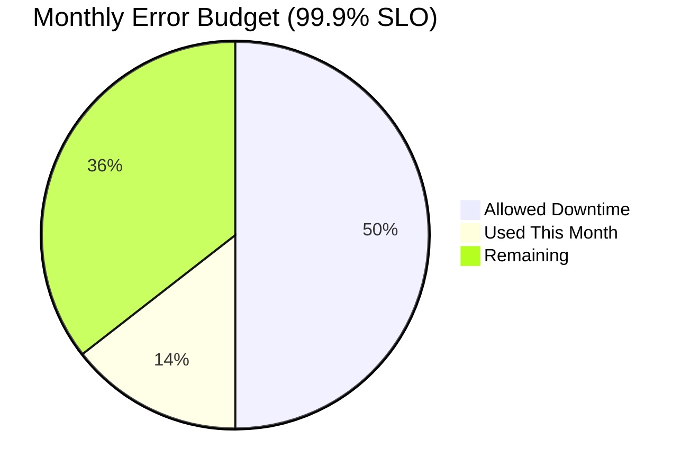

### SLA Commitments (Future)

| Tier | Availability | Support | Price |
|:-----|:-------------|:--------|:------|
| **Free** | Best effort | Community | $0 |
| **Pro** | 99.9% | Email (48h) | $29/mo |
| **Enterprise** | 99.99% | Dedicated (4h) | Custom |

---

## Capacity Planning

### Traffic Projections

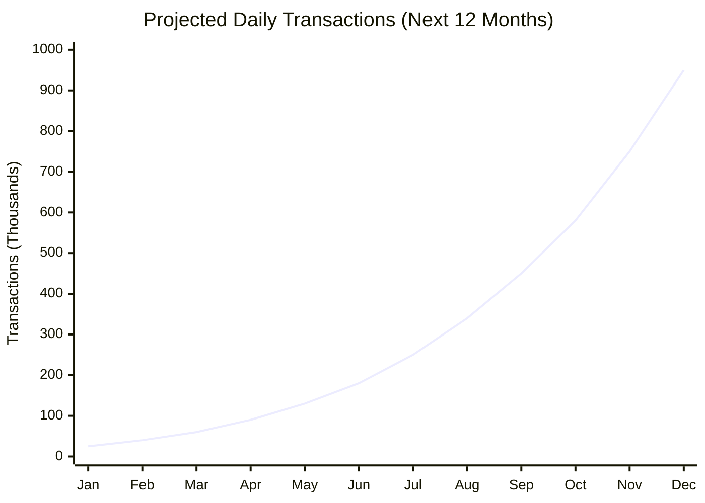

### Resource Requirements by Scale

| MAU | Firestore Reads/Day | Function Invocations/Day | Estimated Cost |
|:----|:--------------------|:-------------------------|:---------------|
| 10K | 500K | 50K | $100/mo |
| 100K | 5M | 500K | $800/mo |
| 1M | 50M | 5M | $5,000/mo |
| 10M | 500M | 50M | $40,000/mo |

### Scaling Milestones

| Milestone | Trigger | Actions Required |
|:----------|:--------|:-----------------|
| **10K MAU** | - | Current architecture sufficient |
| **100K MAU** | Cold starts noticeable | Increase min instances |
| **500K MAU** | Wallet hotspotting | Implement sharded counters |
| **1M MAU** | Query latency | Add caching layer (Redis) |
| **5M MAU** | Single region limits | Multi-region deployment |

---

## Traffic Surge Handling

### Surge Scenarios

| Scenario | Expected Spike | Duration | Strategy |
|:---------|:---------------|:---------|:---------|
| **Marketing Campaign** | 10x normal | 2-4 hours | Pre-warm functions |
| **Viral Referral** | 50x normal | 1-2 days | Rate limiting + queueing |
| **Flash Sale** | 100x normal | 1 hour | Queue + graceful degradation |
| **DDoS Attack** | 1000x normal | Variable | Cloudflare + App Check |

### Graceful Degradation Hierarchy

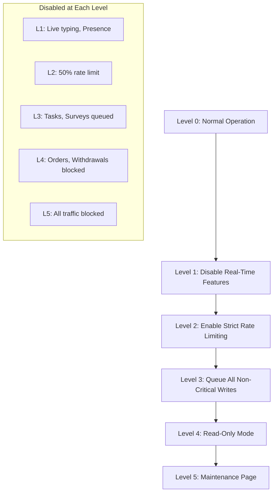

### Surge Response Playbook

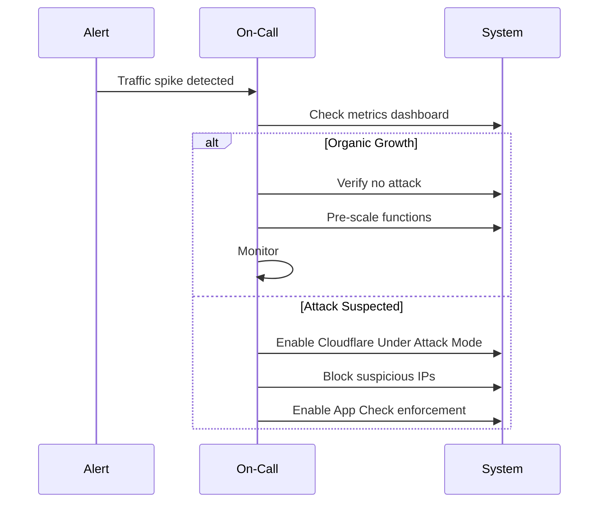

---

## Scaling Activation Triggers

### When to Scale

| Indicator | Threshold | Scaling Action |
|:----------|:----------|:---------------|
| **P95 Latency > 1s** | 5 min sustained | Scale up functions |
| **Error Rate > 5%** | 2 min sustained | Investigate + scale |
| **Queue Depth > 1000** | 1 min sustained | Scale workers |
| **Cold Start Ratio > 30%** | 1 hour | Increase min instances |
| **Wallet Write Contention** | 10 retries/min | Enable sharding |

### Scaling Decision Tree

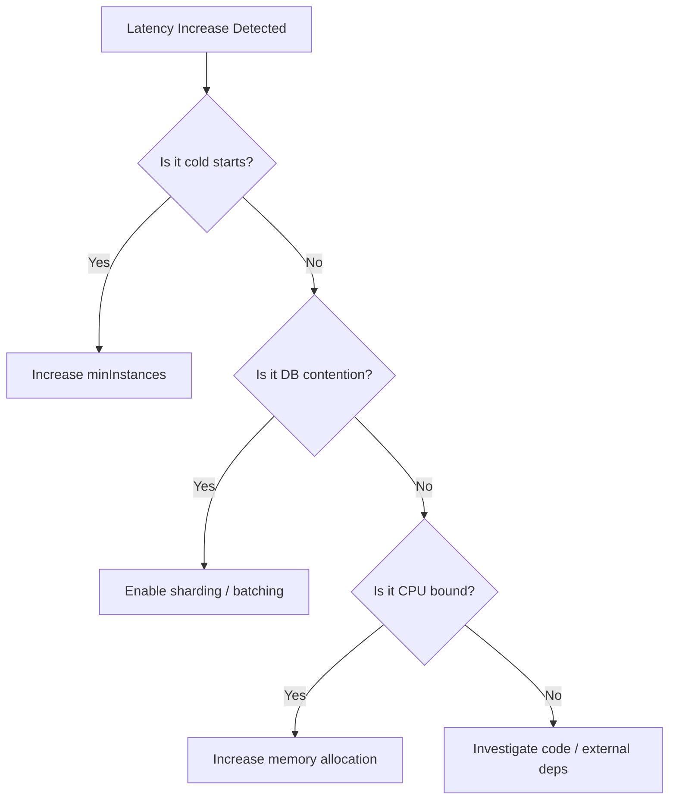

---

*This scaling document guides capacity decisions. Review quarterly or after significant traffic changes.*
