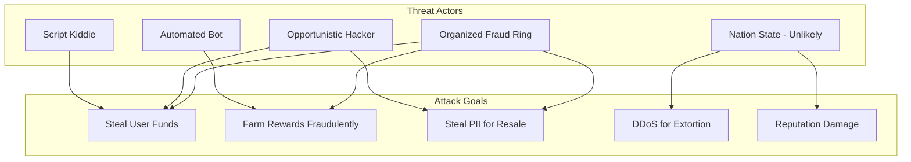
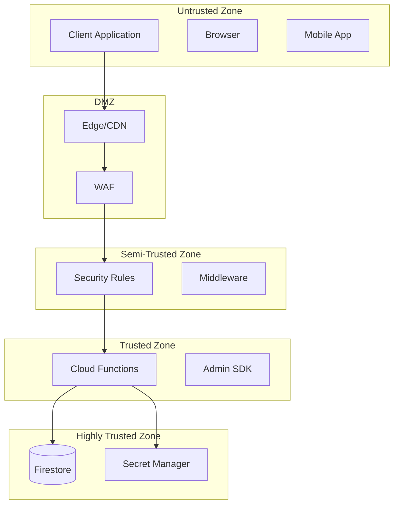
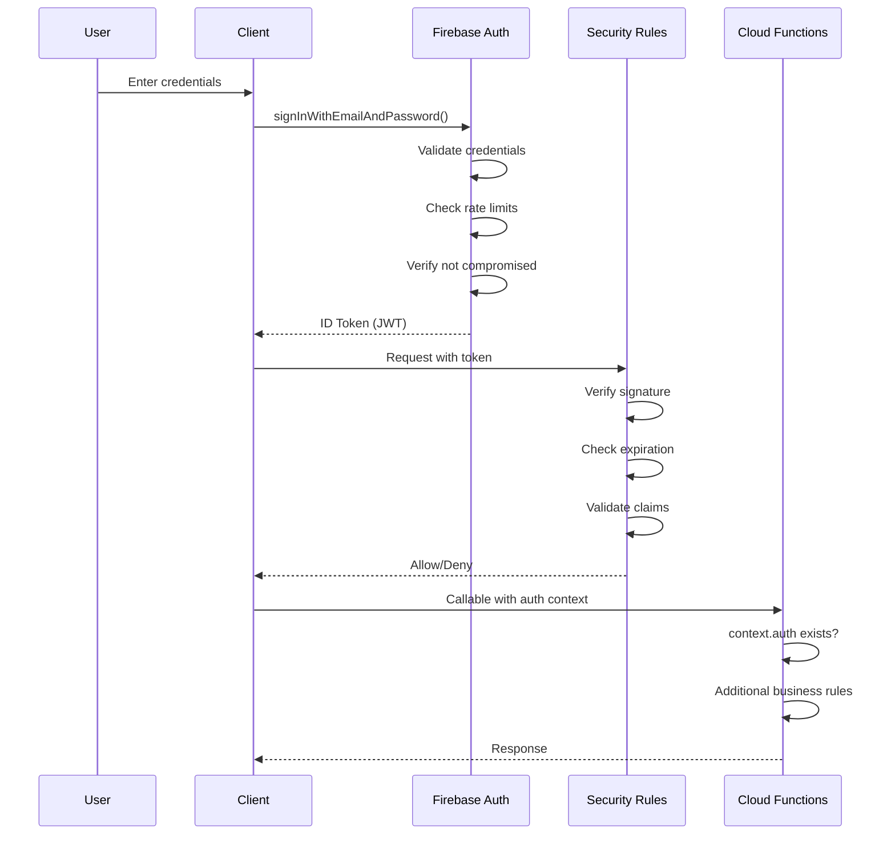
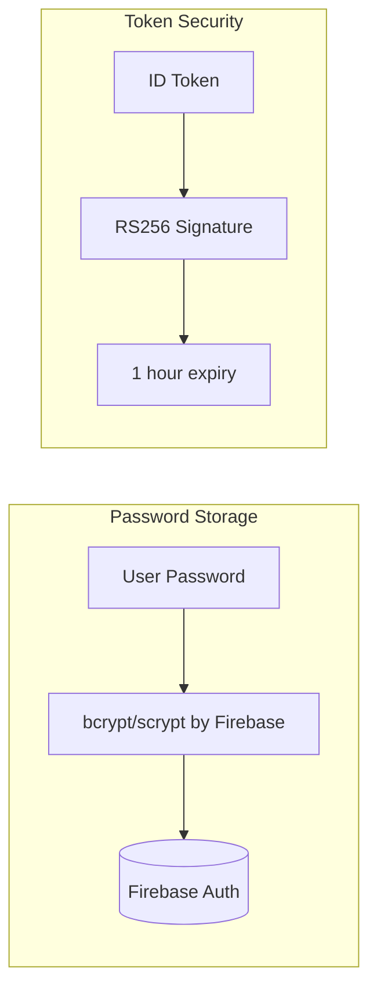
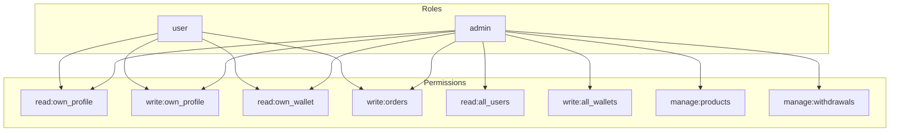
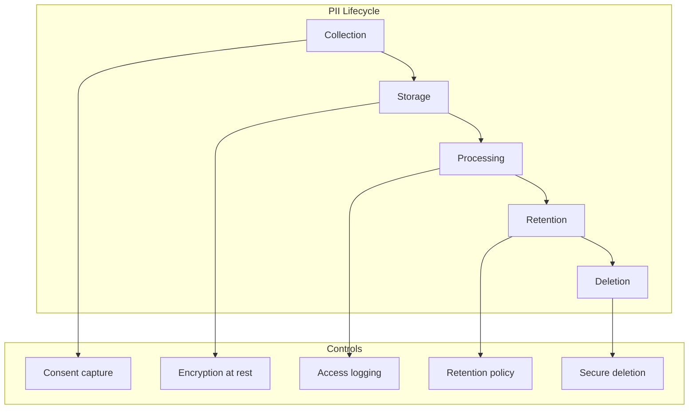
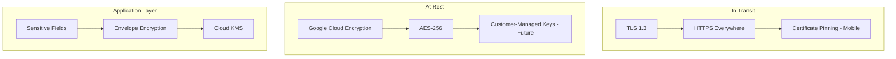
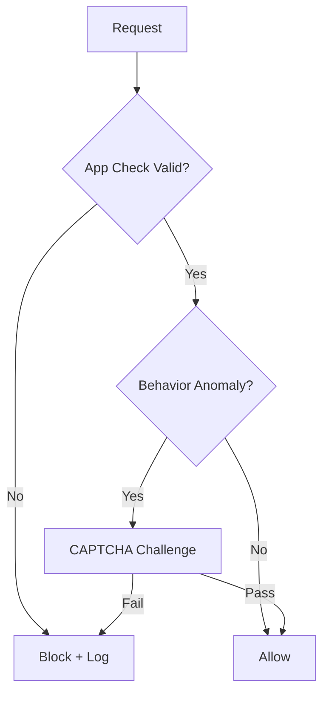
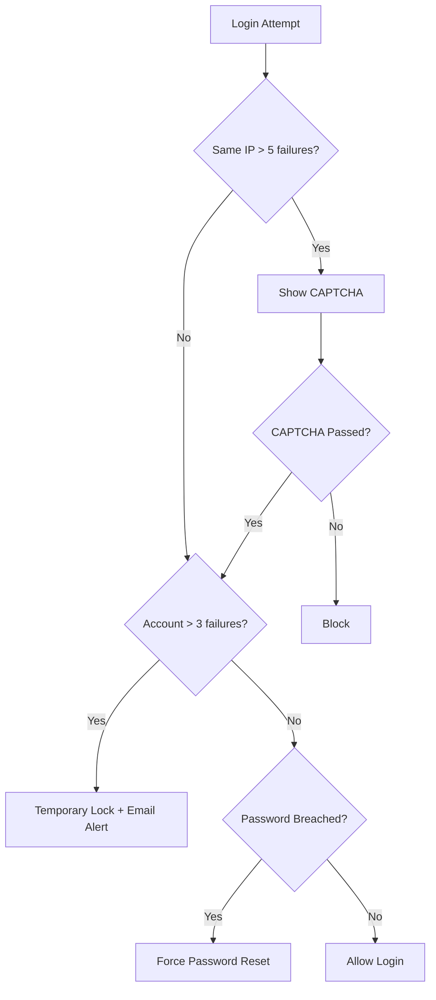
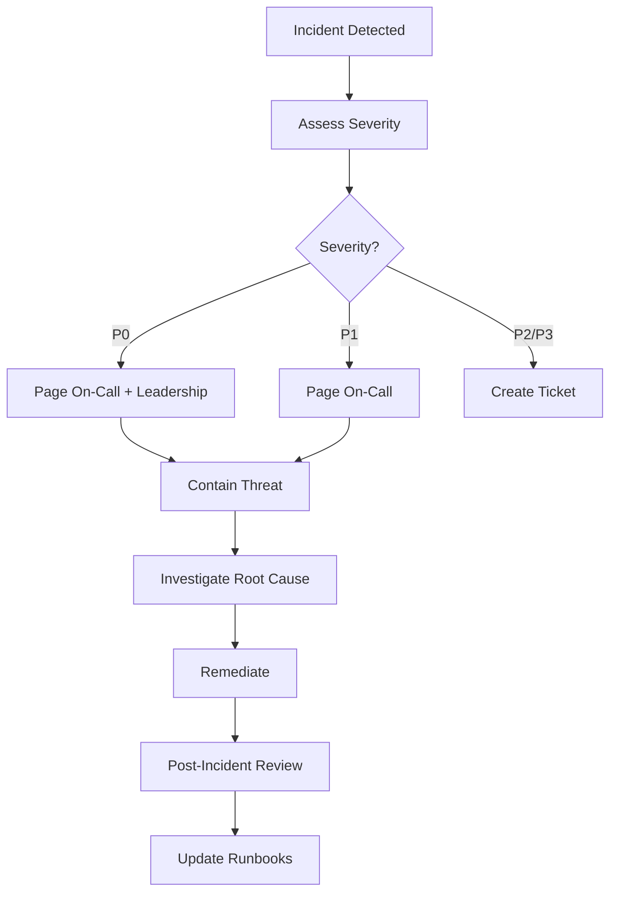

# Security Model

> **Document Version**: 2.0  
> **Last Updated**: January 2026  
> **Classification**: Internal Security Document

---

## Table of Contents
1. [Threat Model](#threat-model)
2. [Trust Boundaries](#trust-boundaries)
3. [Authentication Security](#authentication-security)
4. [Authorization Strategy](#authorization-strategy)
5. [Data Protection](#data-protection)
6. [Encryption Strategy](#encryption-strategy)
7. [Abuse Prevention](#abuse-prevention)
8. [Rate Limiting](#rate-limiting)
9. [Audit Logging](#audit-logging)
10. [Top 10 Attack Vectors & Mitigations](#top-10-attack-vectors--mitigations)
11. [Incident Response](#incident-response)
12. [Compliance Considerations](#compliance-considerations)

---

## Threat Model

### Adversary Profiles



### Risk Assessment Matrix

| Threat | Likelihood | Impact | Risk Score | Priority |
|:-------|:-----------|:-------|:-----------|:---------|
| **Credential Stuffing** | High | High | 🔴 Critical | P0 |
| **Bot Task Farming** | High | Medium | 🟠 High | P1 |
| **Double Spending** | Medium | Critical | 🔴 Critical | P0 |
| **SQL/NoSQL Injection** | Low | Critical | 🟠 High | P1 |
| **XSS Attacks** | Medium | Medium | 🟡 Medium | P2 |
| **DDoS** | Medium | High | 🟠 High | P1 |
| **Insider Threat** | Low | Critical | 🟠 High | P1 |

---

## Trust Boundaries

### Zero Trust Architecture



### Trust Principles

| Principle | Implementation |
|:----------|:---------------|
| **Never trust client input** | All inputs validated server-side with Zod |
| **Never trust client calculations** | All financial math in Cloud Functions |
| **Never trust client time** | Use `FieldValue.serverTimestamp()` |
| **Verify at every layer** | Edge → Rules → Function → Database |
| **Least privilege access** | IAM roles scoped minimally |

---

## Authentication Security

### Authentication Flow



### Authentication Controls

| Control | Implementation | Coverage |
|:--------|:---------------|:---------|
| **Password Policy** | Min 8 chars, complexity | All users |
| **Brute Force Protection** | 5 attempts → CAPTCHA | All endpoints |
| **Leaked Password Detection** | Google Identity Platform | Enabled |
| **MFA (Multi-Factor Auth)** | TOTP/SMS | Admin accounts only |
| **Session Duration** | 1 hour ID token, 6 month refresh | All users |
| **Session Revocation** | On password change, admin action | Immediate |

### Credential Security



---

## Authorization Strategy

### RBAC Model



### Firestore Security Rules (Critical Excerpts)

```javascript
rules_version = '2';
service cloud.firestore {
  match /databases/{database}/documents {
    
    // Helper: Is the user authenticated?
    function isAuthenticated() {
      return request.auth != null;
    }
    
    // Helper: Is the user an admin?
    function isAdmin() {
      return isAuthenticated() && 
             get(/databases/$(database)/documents/users/$(request.auth.uid)).data.role == 'admin';
    }
    
    // Users: Owner or Admin
    match /users/{userId} {
      allow read: if isAuthenticated() && 
                    (request.auth.uid == userId || isAdmin());
      allow update: if isAuthenticated() && 
                     (request.auth.uid == userId || isAdmin());
      allow create: if isAuthenticated() && 
                     request.auth.uid == userId;
    }
    
    // Wallets: Owner read, NO client writes
    match /wallets/{userId} {
      allow read: if isAuthenticated() && 
                    (request.auth.uid == userId || isAdmin());
      allow write: if false; // Server-only via Admin SDK
    }
    
    // Transactions: Immutable, owner read
    match /transactions/{txnId} {
      allow read: if isAuthenticated() && 
                    (request.auth.uid == resource.data.userId || isAdmin());
      allow write: if false; // Server-only
      allow delete: if false; // Never delete
    }
  }
}
```

---

## Data Protection

### Data Classification

| Classification | Examples | Protection Level |
|:---------------|:---------|:-----------------|
| **Public** | Product names, prices | None |
| **Internal** | User counts, aggregates | Access control |
| **Confidential** | User emails, phone numbers | Encryption at rest |
| **Restricted** | Wallet balances, bank details | Encryption + Audit |

### PII Handling



### Data Retention Policy

| Data Type | Retention Period | Deletion Method |
|:----------|:-----------------|:----------------|
| **User Profile** | Account lifetime + 30 days | Soft delete, then purge |
| **Transactions** | 7 years (regulatory) | Archive to cold storage |
| **Task Sessions** | 7 days | Auto-delete |
| **Audit Logs** | 1 year | Archive to cold storage |

---

## Encryption Strategy

### Encryption Layers



### Field-Level Encryption (Sensitive Data)

| Field | Encryption | Key Rotation |
|:------|:-----------|:-------------|
| `bankAccountNumber` | AES-256-GCM | Annual |
| `taxId` | AES-256-GCM | Annual |
| `governmentId` | AES-256-GCM + CMK | Annual |

---

## Abuse Prevention

### Bot Detection



### Fraud Signals

| Signal | Detection | Response |
|:-------|:----------|:---------|
| **Velocity Abuse** | >50 tasks/hour | Auto-lock, manual review |
| **Multi-Account** | Same device ID, IP pattern | Flag for review |
| **Fake Referrals** | Rapid signup from same source | Delay commission |
| **Impossible Travel** | Login from 2 countries in 1 hour | Force re-auth |
| **Payment Fraud** | Chargeback pattern | Suspend withdrawals |

### Fraud Prevention Controls

```typescript
// Velocity check example
async function checkVelocity(userId: string, action: string): Promise<boolean> {
  const key = `velocity:${userId}:${action}`;
  const window = 3600; // 1 hour
  const limit = 50;
  
  const count = await redis.incr(key);
  if (count === 1) {
    await redis.expire(key, window);
  }
  
  if (count > limit) {
    await flagForReview(userId, 'VELOCITY_EXCEEDED', { action, count });
    return false;
  }
  
  return true;
}
```

---

## Rate Limiting

### Rate Limit Configuration

| Endpoint | Limit | Window | Scope | Response |
|:---------|:------|:-------|:------|:---------|
| **Login** | 5 | 15 min | IP | 429 + CAPTCHA |
| **Signup** | 3 | 1 hour | IP | 429 + Wait |
| **API (General)** | 1000 | 1 min | User | 429 Headers |
| **createOrder** | 10 | 1 hour | User | 429 |
| **requestWithdrawal** | 1 | 24 hours | User | 429 |
| **verifyTask** | 100 | 1 hour | User | 429 |

### Rate Limit Response

```json
{
  "error": {
    "code": "resource-exhausted",
    "message": "Rate limit exceeded. Try again in 45 seconds.",
    "details": {
      "retryAfter": 45,
      "limit": 100,
      "remaining": 0,
      "resetAt": "2026-01-31T12:30:00Z"
    }
  }
}
```

---

## Audit Logging

### Audit Events

| Event Category | Events Logged | Retention |
|:---------------|:--------------|:----------|
| **Authentication** | Login, Logout, Password Change, MFA Setup | 90 days |
| **Authorization** | Permission denied, Role change | 1 year |
| **Financial** | All wallet mutations, withdrawals | 7 years |
| **Admin Actions** | All CRUD operations | 1 year |
| **Security** | Rate limit hits, Fraud flags | 1 year |

### Audit Log Schema

```typescript
interface AuditLog {
  id: string;
  timestamp: Timestamp;
  
  // Actor
  actorId: string;          // User ID or 'system'
  actorType: 'user' | 'admin' | 'system';
  actorIp: string;
  actorUserAgent: string;
  
  // Action
  action: string;           // 'wallet.debit', 'user.update', etc.
  resource: string;         // Collection/doc path
  
  // Context
  before?: any;             // State before (for updates)
  after?: any;              // State after
  metadata?: Record<string, any>;
  
  // Result
  success: boolean;
  errorCode?: string;
}
```

---

## Top 10 Attack Vectors & Mitigations

| # | Attack Vector | Likelihood | Mitigation |
|:--|:--------------|:-----------|:-----------|
| **1** | **Credential Stuffing** | High | Rate limiting, CAPTCHA, password breach detection |
| **2** | **Bot Task Farming** | High | App Check, behavioral analysis, delayed rewards |
| **3** | **Double Spending** | Medium | Firestore transactions, idempotency keys |
| **4** | **BOLA (Broken Object Level Auth)** | Medium | Strict ownership checks in Security Rules |
| **5** | **XSS (Cross-Site Scripting)** | Medium | React auto-escaping, strict CSP headers |
| **6** | **CSRF (Cross-Site Request Forgery)** | Low | SameSite cookies, origin validation |
| **7** | **NoSQL Injection** | Low | Firebase SDK parameterization, Zod validation |
| **8** | **DDoS** | Medium | Cloudflare, App Check, auto-scaling |
| **9** | **Session Hijacking** | Low | Secure cookies, short token lifetime, HTTPS |
| **10** | **Insider Threat** | Low | Least privilege IAM, audit logging, access reviews |

### Detailed Mitigation: Credential Stuffing



---

## Incident Response

### Incident Severity

| Severity | Definition | Response Time | Example |
|:---------|:-----------|:--------------|:--------|
| **P0** | Data breach, funds stolen | 15 min | Wallet drain |
| **P1** | Active attack, service down | 1 hour | DDoS, Auth bypass |
| **P2** | Vulnerability discovered | 24 hours | XSS, Logic flaw |
| **P3** | Minor security issue | 1 week | Missing rate limit |

### Incident Response Playbook



---

## Compliance Considerations

### Applicable Regulations

| Regulation | Scope | Key Requirements |
|:-----------|:------|:-----------------|
| **GDPR** | EU users | Data deletion, consent, breach notification |
| **CCPA** | California users | Opt-out, disclosure, deletion |
| **PCI DSS** | Payment data | Not in scope (no card storage) |
| **SOC 2** | All users | Security controls, audit |

### Privacy Controls

| Right | Implementation |
|:------|:---------------|
| **Right to Access** | Export user data via admin panel |
| **Right to Deletion** | Soft delete → 30-day purge |
| **Right to Rectification** | User profile editing |
| **Data Portability** | JSON export |

---

*This security model is reviewed quarterly. All changes require security team approval.*
