# Strategic Roadmap

> **Document Version**: 2.0  
> **Last Updated**: January 2026  
> **Classification**: Internal Strategy Document

---

## Table of Contents
1. [Near-Term Initiatives (Q1-Q2 2026)](#near-term-initiatives-q1-q2-2026)
2. [Mid-Term Initiatives (Q3-Q4 2026)](#mid-term-initiatives-q3-q4-2026)
3. [Long-Term Vision (2027+)](#long-term-vision-2027)
4. [Dangerous Paths To Avoid](#dangerous-paths-to-avoid)
5. [Technical Debt Forecast](#technical-debt-forecast)
6. [Innovation Opportunities](#innovation-opportunities)
7. [Platform Expansion Strategy](#platform-expansion-strategy)

---

## Strategic Timeline Overview

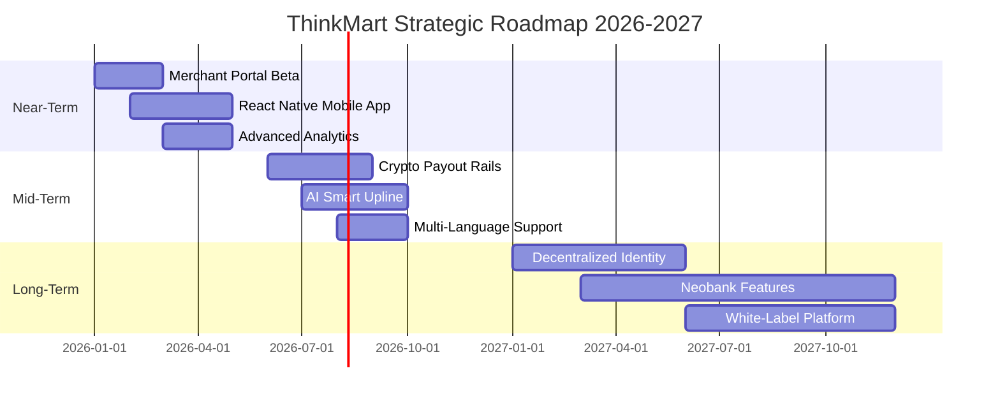

---

## Near-Term Initiatives (Q1-Q2 2026)

### 1. Trusted Merchant Portal (Beta)

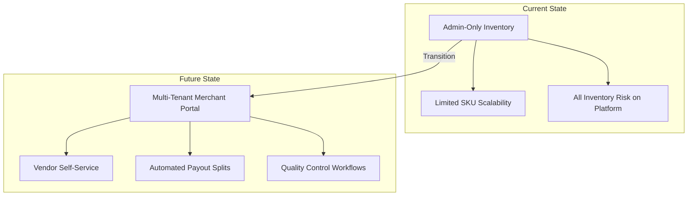

| Dimension | Details |
|:----------|:--------|
| **Problem Solved** | Inventory bottleneck; admin cannot scale to 10,000+ SKUs |
| **Strategic Value** | Transforms ThinkMart from "retailer" to "marketplace" (10x potential GMV) |
| **Technical Difficulty** | 🔴 High |
| **Architectural Approach** | New `merchants` collection with tenant isolation; `merchant_id` FK on products |
| **Dependencies** | Vendor KYC/KYB onboarding flow, Payout infrastructure |
| **Risk Analysis** | Quality control of 3rd-party goods; Return/refund complexity |
| **Organizational Impact** | Requires new "Merchant Success" team |
| **Build vs Buy** | Build internal (core competency) |

**Implementation Phases**:
1. **Phase 1**: Merchant onboarding + Product CRUD
2. **Phase 2**: Order routing + Fulfillment tracking
3. **Phase 3**: Automated commission splits + Payout

---

### 2. High-Performance Mobile App (React Native)

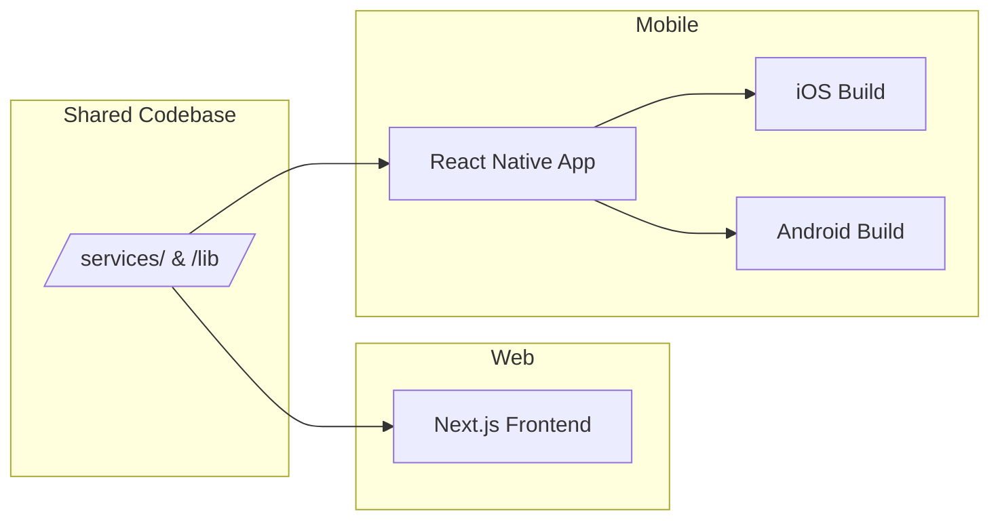

| Dimension | Details |
|:----------|:--------|
| **Problem Solved** | PWA limitations: No persistent push notifications, no biometric auth, no home screen presence |
| **Strategic Value** | 3x higher D30 retention on native apps vs mobile web |
| **Technical Difficulty** | 🟡 Medium |
| **Architectural Approach** | Monorepo; share `services/`, `types/`, and `lib/` between Next.js and React Native |
| **Dependencies** | Firebase React Native SDK, Expo for build tooling |
| **Risk Analysis** | App Store approval delays; iOS/Android feature parity |
| **Build vs Buy** | Build internal |

**Key Features**:
- Biometric login (Face ID / Fingerprint)
- Rich push notifications with deep links
- Offline-first wallet balance caching
- App Clips / Instant Apps for viral referral sharing

---

### 3. Advanced Analytics Dashboard

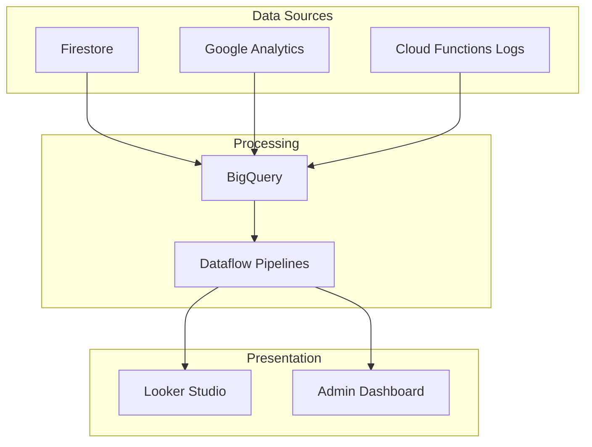

| Dimension | Details |
|:----------|:--------|
| **Problem Solved** | No cohort analysis, no funnel visualization, no predictive metrics |
| **Strategic Value** | Data-driven decisions; investor-grade reporting |
| **Technical Difficulty** | 🟡 Medium |
| **Architectural Approach** | Export Firestore to BigQuery; Looker Studio for visualization |
| **Build vs Buy** | Buy (Looker Studio) + Build (custom dashboards) |

---

## Mid-Term Initiatives (Q3-Q4 2026)

### 4. Global Crypto Payout Rails (USDT/TRC20)

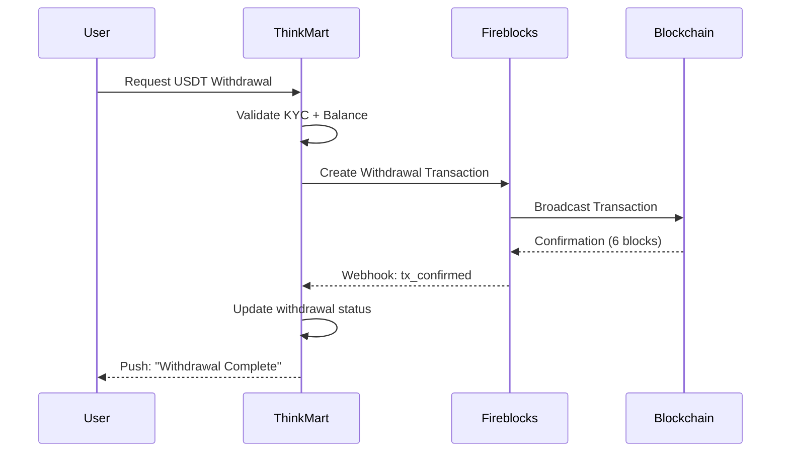

| Dimension | Details |
|:----------|:--------|
| **Problem Solved** | International bank wires are slow ($25+ fees, 3-5 day delay) |
| **Strategic Value** | Unlock user base in unbanked regions (SEA, LATAM, Africa) |
| **Technical Difficulty** | 🔴 Very High |
| **Architectural Approach** | Use Fireblocks MPC wallet (no private keys on our servers) |
| **Dependencies** | KYC/AML provider, Legal review for each jurisdiction |
| **Risk Analysis** | Regulatory landmines; Blockchain finality delays; Gas fee volatility |
| **Build vs Buy** | Buy (Fireblocks) for custody; Build integration layer |

**Compliance Requirements**:
- Travel Rule compliance for transfers >$1000
- Transaction monitoring for suspicious patterns
- Country-specific withdrawal limits

---

### 5. AI-Driven "Smart Upline" Recommendations

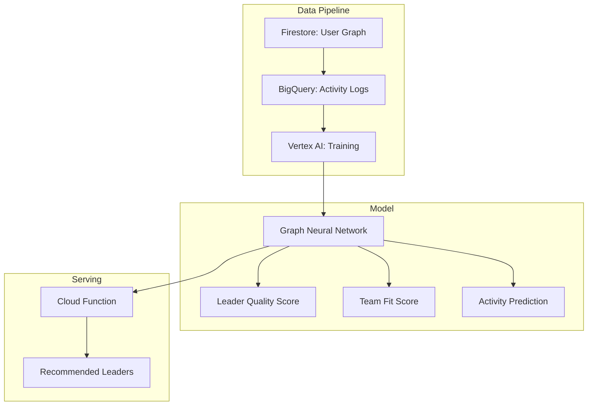

| Dimension | Details |
|:----------|:--------|
| **Problem Solved** | New users stall because they don't know good leaders to join |
| **Strategic Value** | +15-20% activation rate for new signups |
| **Technical Difficulty** | 🔴 High |
| **Architectural Approach** | Export graph to BigQuery; Train GNN on Vertex AI; Serve via Cloud Function |
| **Build vs Buy** | Build (proprietary competitive advantage) |

---

### 6. Multi-Language & Multi-Currency Support

| Dimension | Details |
|:----------|:--------|
| **Problem Solved** | 70% of target market is non-English speaking |
| **Strategic Value** | 5x addressable market expansion |
| **Technical Difficulty** | 🟡 Medium |
| **Architectural Approach** | i18n framework (next-intl); Currency conversion via Open Exchange Rates API |
| **Initial Languages** | English, Hindi, Spanish, Portuguese, Indonesian |

---

## Long-Term Vision (2027+)

### 7. Decentralized Identity & Portable Reputation

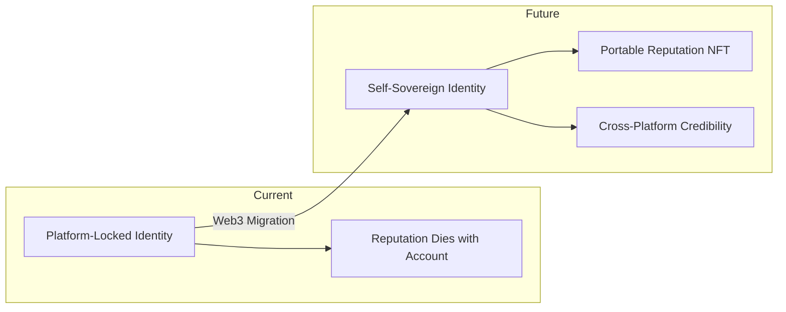

| Dimension | Details |
|:----------|:--------|
| **Problem Solved** | Platform lock-in; Users can't prove their success elsewhere |
| **Strategic Value** | Competitive moat; Attracts Web3-savvy users |
| **Technical Difficulty** | 🔴 Extreme |
| **Approach** | Issue "Leader Credential" as soulbound NFT with provable team stats |

---

### 8. Neobank Evolution

**Vision**: Transition from "Earn & Spend Here" to "Earn Here, Spend Anywhere"

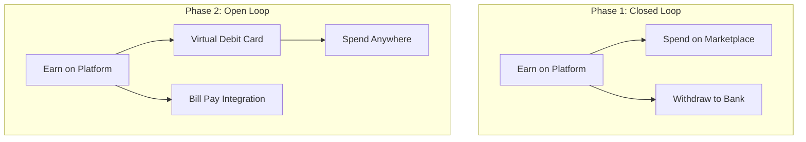

| Dimension | Details |
|:----------|:--------|
| **Problem Solved** | Users want to spend earnings instantly, everywhere |
| **Strategic Value** | Transforms ThinkMart from E-commerce to Fintech (10x valuation multiple) |
| **Dependencies** | Banking license or BaaS partner (e.g., Synapse, Unit) |

---

### 9. White-Label Platform

| Dimension | Details |
|:----------|:--------|
| **Problem Solved** | Other businesses want our MLM + Earning infrastructure |
| **Strategic Value** | SaaS revenue stream; B2B market |
| **Approach** | Multi-tenant architecture; Custom branding per tenant |

---

## Dangerous Paths To Avoid

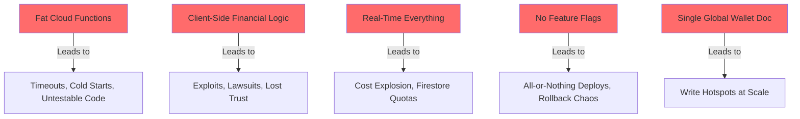

### Anti-Pattern Table

| Dangerous Path | Why It's Tempting | Why It Fails | Correct Approach |
|:---------------|:------------------|:-------------|:-----------------|
| **Monolithic Cloud Function** | Less files to manage | Hits 60-second timeout; no isolation | Single-purpose functions with Pub/Sub choreography |
| **Trust Client Calculations** | Faster UX | Easily manipulated with DevTools | Server computes; client displays |
| **Global onSnapshot Listeners** | Real-time feels cool | Millions of reads = $1000/day bill | Paginated queries; selective real-time |
| **Ship Without Flags** | Faster release | Broken feature affects 100% of users | LaunchDarkly / Firebase Remote Config |

---

## Technical Debt Forecast

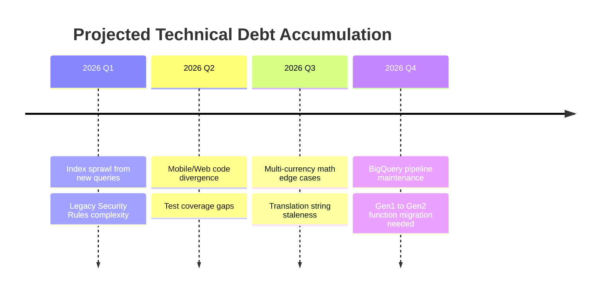

### Debt Categories & Remediation

| Debt Type | Current Severity | Growth Rate | Remediation Strategy |
|:----------|:-----------------|:------------|:---------------------|
| **Firestore Index Explosion** | 🟡 Medium | High | Monthly index audit; Move complex queries to Algolia |
| **Security Rules Complexity** | 🟡 Medium | Medium | Modularize rules; Add rule coverage tests |
| **Cold Start Latency** | 🟡 Medium | Low | Migrate to Gen2; min instances for critical paths |
| **Test Coverage** | 🟡 Medium | Medium | Mandate 80% coverage for new code |

---

## Innovation Opportunities

### 1. Social Commerce: Live Streaming

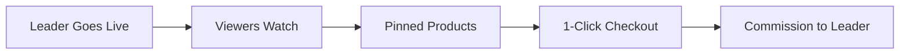

**Value**: Turn top earners into influencers; Real-time sales acceleration.

---

### 2. Gamified Financial Education

| Feature | Description |
|:--------|:------------|
| **ThinkMart Academy** | Earn coins by completing financial literacy quizzes |
| **Investment Simulations** | Paper trading with virtual coins |
| **Tier Rewards** | "Financial Master" badge unlocks premium features |

---

### 3. Peer-to-Peer Lending

**Concept**: Allow high-tier users to lend balance to verified users.

| Risk | Mitigation |
|:-----|:-----------|
| Default | Collateral holds; Credit scoring |
| Regulatory | Legal review per jurisdiction |

---

## Platform Expansion Strategy

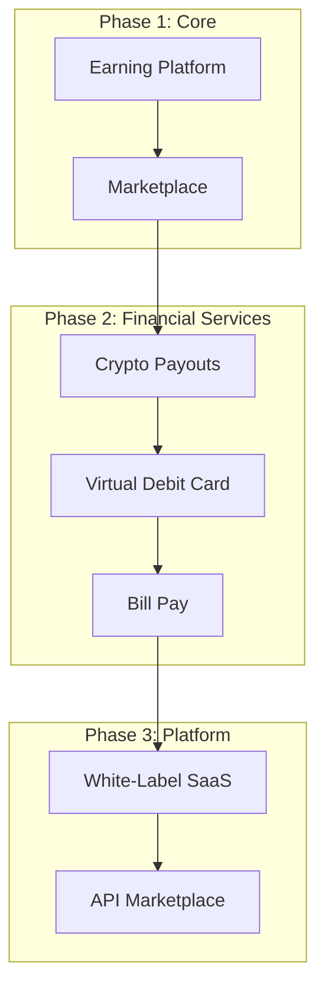

### Geographic Expansion Priority

| Priority | Region | Rationale | Regulatory Complexity |
|:---------|:-------|:----------|:----------------------|
| 1 | India | Largest earner base; English-friendly | 🟡 Medium |
| 2 | Philippines | High remittance volume; MLM culture | 🟢 Low |
| 3 | Indonesia | 270M population; Mobile-first | 🟡 Medium |
| 4 | Brazil | Large informal economy | 🔴 High |
| 5 | Nigeria | Crypto adoption; Unbanked population | 🔴 High |

---

## Success Metrics for Roadmap

| Initiative | Success Metric | Target | Timeline |
|:-----------|:---------------|:-------|:---------|
| Merchant Portal | Active Merchants | 100 | Q2 2026 |
| Mobile App | App Store Rating | 4.5+ | Q2 2026 |
| Crypto Payouts | Withdrawal Volume | 20% of total | Q4 2026 |
| Smart Upline | Activation Rate Lift | +15% | Q4 2026 |

---

*This roadmap is reviewed quarterly by Engineering Leadership. All timelines are estimates and subject to reprioritization.*
